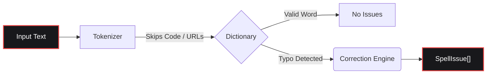

<div align="center">

[](https://www.gohit.xyz/package/fixnow)

<br>

<h1></h1>

<br>

<a href="https://www.npmjs.com/package/fixnow"></a>
<a href="https://www.npmjs.com/package/fixnow"></a>
<a href="https://github.com/bastndev/fixnow/blob/main/LICENSE"></a>
<a href="https://github.com/bastndev/fixnow/stargazers"></a>

<h1></h1>

<p >
  <a href="https://github.com/bastndev/fixnow/blob/main/public/docs/README_ES.md">Español 🇪🇸</a> |
  <a href="https://github.com/bastndev/fixnow/blob/main/public/docs/README_ZH.md">中文 🇨🇳</a> |
  <a href="https://github.com/bastndev/fixnow/blob/main/public/docs/README_DE.md">Deutsch 🇩🇪</a> |
  <a href="https://github.com/bastndev/fixnow/blob/main/public/docs/README_FR.md">Français 🇫🇷</a> |
  <a href="https://github.com/bastndev/fixnow/blob/main/public/docs/README_JA.md">日本語 🇯🇵</a> |
  <a href="https://github.com/bastndev/fixnow/blob/main/public/docs/README_KO.md">한국어 🇰🇷</a> |
  <a href="https://github.com/bastndev/fixnow/blob/main/public/docs/README_PT.md">Português 🇧🇷</a> |
  <a href="https://github.com/bastndev/fixnow/blob/main/public/docs/README_RU.md">Русский 🇷🇺</a> |
  <a href="https://github.com/bastndev/fixnow/blob/main/public/docs/README_VI.md">Tiếng Việt 🇻🇳</a> |
  <a href="https://github.com/bastndev/fixnow/blob/main/public/docs/README_HI.md">हिन्दी 🇮🇳</a> |
  <a href="https://github.com/bastndev/fixnow/blob/main/public/docs/README_AR.md">العربية 🇸🇦</a><span>...</span>
</p>

</div>

<br>

> A tiny multilingual spell checker with correction suggestions. Dictionaries are bundled, so `npm i fixnow` gives you everything — with **zero runtime dependencies**, in both ESM and CommonJS.

## Features

- 📦 **Zero Dependencies** — Keeps your `node_modules` clean and lightweight.
- 🌍 **Built-in Dictionaries** — Includes Arabic, German, English, Spanish, French, Portuguese, Russian, and Vietnamese.
- ⚡ **Slim Builds** — Import only the language you need (e.g. `import { check } from "fixnow/es"`) to optimize bundle size.
- 🛡️ **Smart Tokenization** — Automatically ignores code spans, URLs, emails, and identifiers to prevent false positives.
- 🧩 **Universal** — Works seamlessly in both ESM and CommonJS projects.

## Architecture



## Install

```bash
npm i fixnow
```

## Languages

| Code | Language   | Dictionary license |
| ---- | ---------- | ------------------ |
| `ar` | Arabic     | LGPL-3.0           |
| `de` | German     | LGPL-3.0           |
| `en` | English    | MIT                |
| `es` | Spanish    | LGPL-3.0           |
| `fr` | French     | MIT                |
| `pt` | Portuguese | GPL-3.0-or-later   |
| `ru` | Russian    | GPL-3.0-or-later   |
| `vi` | Vietnamese | MIT                |

## Usage

```ts
import { checkText, suggest, createChecker } from "fixnow";

// English
const enIssues = await checkText("This sentance has a typo", {
  language: "en",
  suggestions: true,
});
// -> [{ offset: 5, length: 8, word: 'sentance', suggestions: [...] }]

// Spanish — opt in to accent leniency if you don't want "codigo" flagged.
const esIssues = await checkText("Esto es un herror", {
  language: "es",
  suggestions: true,
  acceptAccentOmissions: true,
});
// -> [{ offset: 11, length: 6, word: 'herror', suggestions: [...] }]

// One-off correction suggestions
await suggest("bonjoor", { language: "fr" }); // -> ['bonjour', ...]

// A checker bound to one language
const de = createChecker("de");
await de.isCorrect("Haus"); // -> true
```

CommonJS works too:

```js
const { checkText } = require("fixnow");
```

### API

- `checkText(text, options)` → `Promise<SpellIssue[]>`
- `isCorrect(word, language, options?)` → `Promise<boolean>`
- `suggest(word, { language, max? })` → `Promise<string[]>`
- `createChecker(language)` → bound `{ check, suggest, isCorrect, warmup }`
- `warmup(language?)` — preload dictionaries (skip first-call decode cost)
- `tokenize(text, protectedSegments?)`, `DEFAULT_PROTECTED_PATTERN`
- `SUPPORTED_LANGUAGES`, `LANGUAGES`, `isSupportedLanguage`

**`CheckOptions`:** `language` (required), `caseSensitive` (false), `acceptAccentOmissions`
(false; Spanish only), `suggestions`, `maxSuggestions` (5), `minWordLength` (3),
`ignoreWords`, `flagWords`, `isProtectedWord`, `protectedSegments`.

### Tokenization

`checkText` skips anything inside a "protected segment" (code spans, URLs, emails, paths,
CLI flags, hex colors, ACRONYMS, file names and dotted identifiers). Override the
patterns with `protectedSegments`:

```ts
import { checkText, DEFAULT_PROTECTED_PATTERN } from "fixnow";

// Use only your own pattern
await checkText(text, { language: "en", protectedSegments: /\{\{[^}]+\}\}/g });

// Compose with the default
await checkText(text, {
  language: "en",
  protectedSegments: [DEFAULT_PROTECTED_PATTERN, /\{\{[^}]+\}\}/g],
});

// Disable protection entirely
await checkText(text, { language: "en", protectedSegments: false });
```

The same option is exposed on `tokenize(text, protectedSegments)`.

### Slim Builds

If you only need one language, import it via the language subpath. Your bundler only
copies the dictionary you actually use:

```ts
import { check, suggest } from "fixnow/es";

const issues = await check("Esto es un herror", { suggestions: true });
await suggest("bonjoor", 3); // bound suggest is (word, max?)
```

The slim entries (`fixnow/ar`, `fixnow/de`, `fixnow/en`, `fixnow/es`, `fixnow/fr`,
`fixnow/pt`, `fixnow/ru`, `fixnow/vi`) re-export a checker pre-bound to that language.

## Bundling

fixnow reads its dictionaries from disk at runtime — they ship as files under
`node_modules/fixnow/dictionaries/`, not as inlined bytes in the JS. So any bundler
must treat `fixnow` as **external**, leaving it to load from `node_modules` at runtime.
This is required for **VS Code extensions** and any **CJS bundle**: inlining fixnow into
a CJS output strips the path anchor it uses to find its dictionaries, and it will throw
a clear "mark 'fixnow' as external" error instead of resolving them.

```js
// esbuild
await esbuild.build({
  entryPoints: ["src/extension.ts"],
  bundle: true,
  format: "cjs",
  platform: "node",
  external: ["fixnow"],
});
```

The matching option for other bundlers:

- **Vite** — `build.rollupOptions.external: ['fixnow']`
- **Rollup** — `external: ['fixnow']`
- **webpack** — `externals: { fixnow: 'commonjs fixnow' }`

## Migrating from 1.x

`2.0.0` cleans up three rough edges from the extraction-from-F1 release. Each is a
breaking change:

- **`language` is now required.** There is no default language anymore.
  ```ts
  // before
  await checkText("hola"); // implicitly Spanish
  // after
  await checkText("hola", { language: "es" });
  ```
- **`strict` is split into `caseSensitive` and `acceptAccentOmissions`.** The new
  default is strict (the old `strict: true`). If you relied on `strict: false` to
  tolerate Spanish accent omissions, opt in explicitly:
  ```ts
  // before
  await checkText("codigo", { language: "es" }); // accepted
  // after
  await checkText("codigo", { language: "es", acceptAccentOmissions: true });
  ```
  The legacy `strict` key still works in 2.x with a `console.warn`; it is removed in `3.0.0`.
- **F1-specific markers are gone from the default tokenizer.** `[Image #1]`, `[Skills #…]`,
  `/skills #N`, and `/skill` no longer auto-skip. If you need them, pass them via
  `protectedSegments`:
  ```ts
  const F1_MARKERS =
    /\[(?:Image|Code|Text) #\d+[^\]\n]*\]|\[Skills? #[^\]\n]+\]|\/skills #\d+|\/skill\b/g;
  await checkText(text, {
    language: "en",
    protectedSegments: [DEFAULT_PROTECTED_PATTERN, F1_MARKERS],
  });
  ```

## License

[MIT](./LICENSE)
