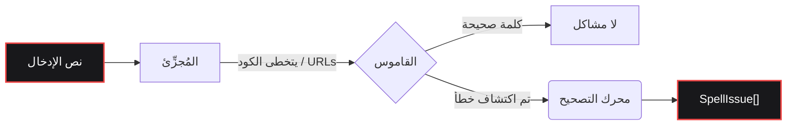

<div align="center">

  <a href="https://www.gohit.xyz/packages/fixnow">
    
  </a>

<br>

<h1></h1>

<br>

<a href="https://www.npmjs.com/package/fixnow"></a>
<a href="https://www.npmjs.com/package/fixnow"></a>
<a href="https://github.com/bastndev/fixnow/blob/main/LICENSE"></a>
<a href="https://github.com/bastndev/fixnow/stargazers"></a>

<h1></h1>

<p >
  <a href="https://github.com/bastndev/fixnow/blob/main/public/docs/README_ES.md">Español 🇪🇸</a> |
  <a href="https://github.com/bastndev/fixnow/blob/main/public/docs/README_ZH.md">中文 🇨🇳</a> |
  <a href="https://github.com/bastndev/fixnow/blob/main/public/docs/README_DE.md">Deutsch 🇩🇪</a> |
  <a href="https://github.com/bastndev/fixnow/blob/main/public/docs/README_FR.md">Français 🇫🇷</a> |
  <a href="https://github.com/bastndev/fixnow/blob/main/public/docs/README_JA.md">日本語 🇯🇵</a> |
  <a href="https://github.com/bastndev/fixnow/blob/main/public/docs/README_KO.md">한국어 🇰🇷</a> |
  <a href="https://github.com/bastndev/fixnow/blob/main/public/docs/README_PT.md">Português 🇧🇷</a> |
  <a href="https://github.com/bastndev/fixnow/blob/main/public/docs/README_RU.md">Русский 🇷🇺</a> |
  <a href="https://github.com/bastndev/fixnow/blob/main/public/docs/README_VI.md">Tiếng Việt 🇻🇳</a> |
  <a href="https://github.com/bastndev/fixnow/blob/main/public/docs/README_HI.md">हिन्दी 🇮🇳</a> |
  <a href="https://github.com/bastndev/fixnow/blob/main/public/docs/README_AR.md">العربية 🇸🇦</a><span>...</span>
</p>

</div>

<br>

> مدقق إملائي متعدد اللغات صغير الحجم مع اقتراحات تصحيح. القواميس مضمنة، لذا `npm i fixnow` يمنحك كل ما تحتاجه — مع **صفر تبعيات وقت التشغيل**، في كل من ESM و CommonJS.

## المميزات

- 📦 **صفر تبعيات** — يبقي `node_modules` نظيفًا وخفيفًا.
- 🌍 **قواميس مدمجة** — يتضمن العربية والألمانية والإنجليزية والإسبانية والفرنسية والبرتغالية والروسية والفيتنامية.
- ⚡ **بناءات خفيفة** — استورد فقط اللغة التي تحتاجها (مثل `import { check } from "fixnow/ar"`) لتحسين حجم الحزمة.
- 🛡️ **تقسيم ذكي للرموز** — يتجاهل تلقائيًا مقاطع الكود وعناوين URL والبريد الإلكتروني والمعرفات لمنع النتائج الإيجابية الخاطئة.
- 🧩 **عالمي** — يعمل بسلاسة في مشاريع ESM و CommonJS على حد سواء.

## البنية



## التثبيت

```bash
npm i fixnow
```

## اللغات

| الرمز | اللغة       | ترخيص القاموس    |
| ----- | ----------- | ---------------- |
| `ar`  | العربية     | LGPL-3.0         |
| `de`  | الألمانية   | LGPL-3.0         |
| `en`  | الإنجليزية  | MIT              |
| `es`  | الإسبانية   | LGPL-3.0         |
| `fr`  | الفرنسية    | MIT              |
| `pt`  | البرتغالية  | GPL-3.0-or-later |
| `ru`  | الروسية     | GPL-3.0-or-later |
| `vi`  | الفيتنامية  | MIT              |

## الاستخدام

```ts
import { checkText, suggest, createChecker } from "fixnow";

// الإنجليزية
const enIssues = await checkText("This sentance has a typo", {
  language: "en",
  suggestions: true,
});
// -> [{ offset: 5, length: 8, word: 'sentance', suggestions: [...] }]

// الإسبانية — فعّل التساهل مع علامات التشكيل إذا لم ترغب في تمييز "codigo".
const esIssues = await checkText("Esto es un herror", {
  language: "es",
  suggestions: true,
  acceptAccentOmissions: true,
});
// -> [{ offset: 11, length: 6, word: 'herror', suggestions: [...] }]

// اقتراحات تصحيح لمرة واحدة
await suggest("bonjoor", { language: "fr" }); // -> ['bonjour', ...]

// مدقق مرتبط بلغة واحدة
const de = createChecker("de");
await de.isCorrect("Haus"); // -> true
```

CommonJS يعمل أيضًا:

```js
const { checkText } = require("fixnow");
```

### API

- `checkText(text, options)` → `Promise<SpellIssue[]>`
- `isCorrect(word, language, options?)` → `Promise<boolean>`
- `suggest(word, { language, max? })` → `Promise<string[]>`
- `createChecker(language)` → مرتبط `{ check, suggest, isCorrect, warmup }`
- `warmup(language?)` — التحميل المسبق للقواميس (تخطي تكلفة فك التشفير في الاستدعاء الأول)
- `tokenize(text, protectedSegments?)`، `DEFAULT_PROTECTED_PATTERN`
- `SUPPORTED_LANGUAGES`، `LANGUAGES`، `isSupportedLanguage`

**`CheckOptions`:** `language` (مطلوب)، `caseSensitive` (false)، `acceptAccentOmissions`
(false؛ الإسبانية فقط)، `suggestions`، `maxSuggestions` (5)، `minWordLength` (3)،
`ignoreWords`، `flagWords`، `isProtectedWord`، `protectedSegments`.

### تقسيم الرموز

يتخطى `checkText` أي شيء داخل "مقطع محمي" (مقاطع الكود وعناوين URL والبريد الإلكتروني والمسارات
وأعلام CLI وألوان hex والاختصارات وأسماء الملفات والمعرفات المنقّطة). استبدل الأنماط باستخدام
`protectedSegments`:

```ts
import { checkText, DEFAULT_PROTECTED_PATTERN } from "fixnow";

// استخدم نمطك الخاص فقط
await checkText(text, { language: "en", protectedSegments: /\{\{[^}]+\}\}/g });

// ادمجه مع النمط الافتراضي
await checkText(text, {
  language: "en",
  protectedSegments: [DEFAULT_PROTECTED_PATTERN, /\{\{[^}]+\}\}/g],
});

// تعطيل الحماية بالكامل
await checkText(text, { language: "en", protectedSegments: false });
```

نفس الخيار متاح في `tokenize(text, protectedSegments)`.

### بناءات خفيفة

إذا كنت بحاجة إلى لغة واحدة فقط، فاستوردها عبر المسار الفرعي للغة. سيقوم المُجمِّع بنسخ القاموس الذي
تستخدمه فعليًا فقط:

```ts
import { check, suggest } from "fixnow/ar";

const issues = await check("Esto es un herror", { suggestions: true });
await suggest("bonjoor", 3); // suggest المرتبط هو (word, max?)
```

المداخل الخفيفة (`fixnow/ar`، `fixnow/de`، `fixnow/en`، `fixnow/es`، `fixnow/fr`،
`fixnow/pt`، `fixnow/ru`، `fixnow/vi`) تعيد تصدير مدقق مرتبط مسبقًا بتلك اللغة.

## التجميع (Bundling)

يقرأ fixnow قواميسه من القرص في وقت التشغيل — يتم شحنها كملفات ضمن
`node_modules/fixnow/dictionaries/`، وليست كبايتات مضمنة في JS. لذا يجب على أي مُجمِّع التعامل مع
`fixnow` على أنه **خارجي (external)**، تاركًا له التحميل من `node_modules` في وقت التشغيل. هذا
مطلوب لـ **امتدادات VS Code** وأي **حزمة CJS**: تضمين fixnow في مخرجات CJS يزيل مرساة المسار التي
يستخدمها للعثور على قواميسه، وسيُطلق خطأً واضحًا "mark 'fixnow' as external" بدلًا من حلها.

```js
// esbuild
await esbuild.build({
  entryPoints: ["src/extension.ts"],
  bundle: true,
  format: "cjs",
  platform: "node",
  external: ["fixnow"],
});
```

الخيار المقابل للمُجمِّعات الأخرى:

- **Vite** — `build.rollupOptions.external: ['fixnow']`
- **Rollup** — `external: ['fixnow']`
- **webpack** — `externals: { fixnow: 'commonjs fixnow' }`

## الترحيل من 1.x

تنظف `2.0.0` ثلاث نقاط خشنة من الإصدار المستخرج من F1. كل منها تغيير كاسر للتوافق:

- **`language` أصبح الآن مطلوبًا.** لم تعد هناك لغة افتراضية.
  ```ts
  // قبل
  await checkText("hola"); // إسبانية ضمنيًا
  // بعد
  await checkText("hola", { language: "es" });
  ```
- **تم تقسيم `strict` إلى `caseSensitive` و `acceptAccentOmissions`.** الإعداد
  الافتراضي الجديد صارم (القديم `strict: true`). إذا كنت تعتمد على `strict: false`
  للتسامح مع حذف علامات التشكيل الإسبانية، فعّله صراحةً:
  ```ts
  // قبل
  await checkText("codigo", { language: "es" }); // مقبول
  // بعد
  await checkText("codigo", { language: "es", acceptAccentOmissions: true });
  ```
  لا يزال المفتاح القديم `strict` يعمل في 2.x مع `console.warn`؛ وتتم إزالته في `3.0.0`.
- **اختفت العلامات الخاصة بـ F1 من المُجزِّئ الافتراضي.** `[Image #1]`، `[Skills #…]`،
  `/skills #N` و `/skill` لم تعد تُتخطى تلقائيًا. إذا احتجتها، فمررها عبر
  `protectedSegments`:
  ```ts
  const F1_MARKERS = /\[(?:Image|Code|Text) #\d+[^\]\n]*\]|\[Skills? #[^\]\n]+\]|\/skills #\d+|\/skill\b/g;
  await checkText(text, {
    language: "en",
    protectedSegments: [DEFAULT_PROTECTED_PATTERN, F1_MARKERS],
  });
  ```

## الترخيص

[MIT](../../LICENSE)
