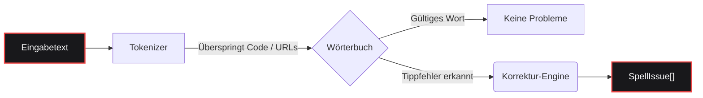

<div align="center">

  <a href="https://www.gohit.xyz/packages/fixnow">
    
  </a>

<br>

<h1></h1>

<br>

<a href="https://www.npmjs.com/package/fixnow"></a>
<a href="https://www.npmjs.com/package/fixnow"></a>
<a href="https://github.com/bastndev/fixnow/blob/main/LICENSE"></a>
<a href="https://github.com/bastndev/fixnow/stargazers"></a>

<h1></h1>

<p >
  <a href="https://github.com/bastndev/fixnow/blob/main/public/docs/README_ES.md">Español 🇪🇸</a> |
  <a href="https://github.com/bastndev/fixnow/blob/main/public/docs/README_ZH.md">中文 🇨🇳</a> |
  <a href="https://github.com/bastndev/fixnow/blob/main/public/docs/README_DE.md">Deutsch 🇩🇪</a> |
  <a href="https://github.com/bastndev/fixnow/blob/main/public/docs/README_FR.md">Français 🇫🇷</a> |
  <a href="https://github.com/bastndev/fixnow/blob/main/public/docs/README_JA.md">日本語 🇯🇵</a> |
  <a href="https://github.com/bastndev/fixnow/blob/main/public/docs/README_KO.md">한국어 🇰🇷</a> |
  <a href="https://github.com/bastndev/fixnow/blob/main/public/docs/README_PT.md">Português 🇧🇷</a> |
  <a href="https://github.com/bastndev/fixnow/blob/main/public/docs/README_RU.md">Русский 🇷🇺</a> |
  <a href="https://github.com/bastndev/fixnow/blob/main/public/docs/README_VI.md">Tiếng Việt 🇻🇳</a> |
  <a href="https://github.com/bastndev/fixnow/blob/main/public/docs/README_HI.md">हिन्दी 🇮🇳</a> |
  <a href="https://github.com/bastndev/fixnow/blob/main/public/docs/README_AR.md">العربية 🇸🇦</a><span>...</span>
</p>

</div>

<br>

> Ein winziges mehrsprachiges Rechtschreibprüfprogramm mit Korrekturvorschlägen. Wörterbücher sind gebündelt, sodass `npm i fixnow` Ihnen alles bietet — mit **null Laufzeitabhängigkeiten**, sowohl in ESM als auch in CommonJS.

## Funktionen

- 📦 **Null Abhängigkeiten** — Hält Ihr `node_modules` sauber und schlank.
- 🌍 **Integrierte Wörterbücher** — Enthält Arabisch, Deutsch, Englisch, Spanisch, Französisch, Portugiesisch, Russisch und Vietnamesisch.
- ⚡ **Schlanke Builds** — Importieren Sie nur die benötigte Sprache (z. B. `import { check } from "fixnow/de"`), um die Bundle-Größe zu optimieren.
- 🛡️ **Intelligente Tokenisierung** — Ignoriert automatisch Code-Abschnitte, URLs, E-Mails und Bezeichner, um Fehlalarme zu vermeiden.
- 🧩 **Universell** — Funktioniert nahtlos in ESM- und CommonJS-Projekten.

## Architektur



## Installation

```bash
npm i fixnow
```

## Sprachen

| Code | Sprache       | Wörterbuch-Lizenz |
| ---- | ------------- | ----------------- |
| `ar` | Arabisch      | LGPL-3.0          |
| `de` | Deutsch       | LGPL-3.0          |
| `en` | Englisch      | MIT               |
| `es` | Spanisch      | LGPL-3.0          |
| `fr` | Französisch   | MIT               |
| `pt` | Portugiesisch | GPL-3.0-or-later  |
| `ru` | Russisch      | GPL-3.0-or-later  |
| `vi` | Vietnamesisch | MIT               |

## Verwendung

```ts
import { checkText, suggest, createChecker } from "fixnow";

// Englisch
const enIssues = await checkText("This sentance has a typo", {
  language: "en",
  suggestions: true,
});
// -> [{ offset: 5, length: 8, word: 'sentance', suggestions: [...] }]

// Spanisch — Akzent-Nachsicht aktivieren, wenn "codigo" nicht markiert werden soll.
const esIssues = await checkText("Esto es un herror", {
  language: "es",
  suggestions: true,
  acceptAccentOmissions: true,
});
// -> [{ offset: 11, length: 6, word: 'herror', suggestions: [...] }]

// Einmalige Korrekturvorschläge
await suggest("bonjoor", { language: "fr" }); // -> ['bonjour', ...]

// Ein an eine Sprache gebundener Checker
const de = createChecker("de");
await de.isCorrect("Haus"); // -> true
```

CommonJS funktioniert auch:

```js
const { checkText } = require("fixnow");
```

### API

- `checkText(text, options)` → `Promise<SpellIssue[]>`
- `isCorrect(word, language, options?)` → `Promise<boolean>`
- `suggest(word, { language, max? })` → `Promise<string[]>`
- `createChecker(language)` → gebunden `{ check, suggest, isCorrect, warmup }`
- `warmup(language?)` — Wörterbücher vorladen (die Dekodierungskosten des ersten Aufrufs überspringen)
- `tokenize(text, protectedSegments?)`, `DEFAULT_PROTECTED_PATTERN`
- `SUPPORTED_LANGUAGES`, `LANGUAGES`, `isSupportedLanguage`

**`CheckOptions`:** `language` (erforderlich), `caseSensitive` (false), `acceptAccentOmissions`
(false; nur Spanisch), `suggestions`, `maxSuggestions` (5), `minWordLength` (3),
`ignoreWords`, `flagWords`, `isProtectedWord`, `protectedSegments`.

### Tokenisierung

`checkText` überspringt alles innerhalb eines "geschützten Segments" (Code-Abschnitte, URLs, E-Mails,
Pfade, CLI-Flags, Hex-Farben, AKRONYME, Dateinamen und punktierte Bezeichner). Überschreiben Sie die
Muster mit `protectedSegments`:

```ts
import { checkText, DEFAULT_PROTECTED_PATTERN } from "fixnow";

// Nur Ihr eigenes Muster verwenden
await checkText(text, { language: "en", protectedSegments: /\{\{[^}]+\}\}/g });

// Mit dem Standard kombinieren
await checkText(text, {
  language: "en",
  protectedSegments: [DEFAULT_PROTECTED_PATTERN, /\{\{[^}]+\}\}/g],
});

// Schutz vollständig deaktivieren
await checkText(text, { language: "en", protectedSegments: false });
```

Dieselbe Option steht bei `tokenize(text, protectedSegments)` zur Verfügung.

### Schlanke Builds

Wenn Sie nur eine Sprache benötigen, importieren Sie sie über den Sprach-Subpfad. Ihr Bundler kopiert
nur das Wörterbuch, das Sie tatsächlich verwenden:

```ts
import { check, suggest } from "fixnow/de";

const issues = await check("Das ist ein Feler", { suggestions: true });
await suggest("Hsus", 3); // gebundenes suggest ist (word, max?)
```

Die schlanken Einträge (`fixnow/ar`, `fixnow/de`, `fixnow/en`, `fixnow/es`, `fixnow/fr`,
`fixnow/pt`, `fixnow/ru`, `fixnow/vi`) reexportieren einen bereits an diese Sprache gebundenen Checker.

## Bundling

fixnow liest seine Wörterbücher zur Laufzeit von der Festplatte — sie werden als Dateien unter
`node_modules/fixnow/dictionaries/` ausgeliefert, nicht als eingebettete Bytes im JS. Daher muss jeder
Bundler `fixnow` als **extern** behandeln und es zur Laufzeit aus `node_modules` laden lassen.
Dies ist für **VS-Code-Erweiterungen** und jedes **CJS-Bundle** erforderlich: Das Einbetten von fixnow
in eine CJS-Ausgabe entfernt den Pfadanker, mit dem es seine Wörterbücher findet, und es wirft einen
klaren Fehler "mark 'fixnow' as external", anstatt sie aufzulösen.

```js
// esbuild
await esbuild.build({
  entryPoints: ["src/extension.ts"],
  bundle: true,
  format: "cjs",
  platform: "node",
  external: ["fixnow"],
});
```

Die entsprechende Option für andere Bundler:

- **Vite** — `build.rollupOptions.external: ['fixnow']`
- **Rollup** — `external: ['fixnow']`
- **webpack** — `externals: { fixnow: 'commonjs fixnow' }`

## Migration von 1.x

`2.0.0` beseitigt drei Schwachstellen der aus F1 extrahierten Version. Jede ist eine inkompatible
Änderung:

- **`language` ist jetzt erforderlich.** Es gibt keine Standardsprache mehr.
  ```ts
  // vorher
  await checkText("hola"); // implizit Spanisch
  // nachher
  await checkText("hola", { language: "es" });
  ```
- **`strict` wird in `caseSensitive` und `acceptAccentOmissions` aufgeteilt.** Der neue
  Standard ist strikt (das alte `strict: true`). Wenn Sie sich auf `strict: false` verlassen haben, um
  spanische Akzent-Auslassungen zu tolerieren, aktivieren Sie dies explizit:
  ```ts
  // vorher
  await checkText("codigo", { language: "es" }); // akzeptiert
  // nachher
  await checkText("codigo", { language: "es", acceptAccentOmissions: true });
  ```
  Der veraltete Schlüssel `strict` funktioniert in 2.x weiterhin mit einer `console.warn`; in `3.0.0` wird er entfernt.
- **F1-spezifische Marker sind aus dem Standard-Tokenizer verschwunden.** `[Image #1]`, `[Skills #…]`,
  `/skills #N` und `/skill` werden nicht mehr automatisch übersprungen. Wenn Sie sie benötigen, übergeben Sie sie über
  `protectedSegments`:
  ```ts
  const F1_MARKERS = /\[(?:Image|Code|Text) #\d+[^\]\n]*\]|\[Skills? #[^\]\n]+\]|\/skills #\d+|\/skill\b/g;
  await checkText(text, {
    language: "en",
    protectedSegments: [DEFAULT_PROTECTED_PATTERN, F1_MARKERS],
  });
  ```

## Lizenz

[MIT](../../LICENSE)
