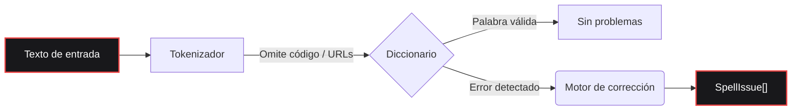

<div align="center">

  <a href="https://www.gohit.xyz/packages/fixnow">
    
  </a>

<br>

<h1></h1>

<br>

<a href="https://www.npmjs.com/package/fixnow"></a>
<a href="https://www.npmjs.com/package/fixnow"></a>
<a href="https://github.com/bastndev/fixnow/blob/main/LICENSE"></a>
<a href="https://github.com/bastndev/fixnow/stargazers"></a>

<h1></h1>

<p >
  <a href="https://github.com/bastndev/fixnow/blob/main/public/docs/README_ES.md">Español 🇪🇸</a> |
  <a href="https://github.com/bastndev/fixnow/blob/main/public/docs/README_ZH.md">中文 🇨🇳</a> |
  <a href="https://github.com/bastndev/fixnow/blob/main/public/docs/README_DE.md">Deutsch 🇩🇪</a> |
  <a href="https://github.com/bastndev/fixnow/blob/main/public/docs/README_FR.md">Français 🇫🇷</a> |
  <a href="https://github.com/bastndev/fixnow/blob/main/public/docs/README_JA.md">日本語 🇯🇵</a> |
  <a href="https://github.com/bastndev/fixnow/blob/main/public/docs/README_KO.md">한국어 🇰🇷</a> |
  <a href="https://github.com/bastndev/fixnow/blob/main/public/docs/README_PT.md">Português 🇧🇷</a> |
  <a href="https://github.com/bastndev/fixnow/blob/main/public/docs/README_RU.md">Русский 🇷🇺</a> |
  <a href="https://github.com/bastndev/fixnow/blob/main/public/docs/README_VI.md">Tiếng Việt 🇻🇳</a> |
  <a href="https://github.com/bastndev/fixnow/blob/main/public/docs/README_HI.md">हिन्दी 🇮🇳</a> |
  <a href="https://github.com/bastndev/fixnow/blob/main/public/docs/README_AR.md">العربية 🇸🇦</a><span>...</span>
</p>

</div>

<br>

> Un pequeño corrector ortográfico multilingüe con sugerencias de corrección. Los diccionarios vienen incluidos, así que `npm i fixnow` te da todo lo necesario — con **cero dependencias en tiempo de ejecución**, tanto en ESM como en CommonJS.

## Características

- 📦 **Cero dependencias** — Mantiene tu `node_modules` limpio y ligero.
- 🌍 **Diccionarios integrados** — Incluye árabe, alemán, inglés, español, francés, portugués, ruso y vietnamita.
- ⚡ **Compilaciones ligeras** — Importa solo el idioma que necesitas (p. ej. `import { check } from "fixnow/es"`) para optimizar el tamaño del bundle.
- 🛡️ **Tokenización inteligente** — Ignora automáticamente fragmentos de código, URLs, correos e identificadores para evitar falsos positivos.
- 🧩 **Universal** — Funciona sin problemas tanto en proyectos ESM como CommonJS.

## Arquitectura



## Instalación

```bash
npm i fixnow
```

## Idiomas

| Código | Idioma     | Licencia del diccionario |
| ------ | ---------- | ------------------------ |
| `ar`   | Árabe      | LGPL-3.0                 |
| `de`   | Alemán     | LGPL-3.0                 |
| `en`   | Inglés     | MIT                      |
| `es`   | Español    | LGPL-3.0                 |
| `fr`   | Francés    | MIT                      |
| `pt`   | Portugués  | GPL-3.0-or-later         |
| `ru`   | Ruso       | GPL-3.0-or-later         |
| `vi`   | Vietnamita | MIT                      |

## Uso

```ts
import { checkText, suggest, createChecker } from "fixnow";

// Inglés
const enIssues = await checkText("This sentance has a typo", {
  language: "en",
  suggestions: true,
});
// -> [{ offset: 5, length: 8, word: 'sentance', suggestions: [...] }]

// Español — activa la tolerancia a acentos si no quieres que "codigo" se marque.
const esIssues = await checkText("Esto es un herror", {
  language: "es",
  suggestions: true,
  acceptAccentOmissions: true,
});
// -> [{ offset: 11, length: 6, word: 'herror', suggestions: [...] }]

// Sugerencias de corrección puntuales
await suggest("bonjoor", { language: "fr" }); // -> ['bonjour', ...]

// Un corrector vinculado a un idioma
const de = createChecker("de");
await de.isCorrect("Haus"); // -> true
```

También funciona con CommonJS:

```js
const { checkText } = require("fixnow");
```

### API

- `checkText(text, options)` → `Promise<SpellIssue[]>`
- `isCorrect(word, language, options?)` → `Promise<boolean>`
- `suggest(word, { language, max? })` → `Promise<string[]>`
- `createChecker(language)` → vinculado `{ check, suggest, isCorrect, warmup }`
- `warmup(language?)` — precarga los diccionarios (evita el costo de decodificación de la primera llamada)
- `tokenize(text, protectedSegments?)`, `DEFAULT_PROTECTED_PATTERN`
- `SUPPORTED_LANGUAGES`, `LANGUAGES`, `isSupportedLanguage`

**`CheckOptions`:** `language` (requerido), `caseSensitive` (false), `acceptAccentOmissions`
(false; solo español), `suggestions`, `maxSuggestions` (5), `minWordLength` (3),
`ignoreWords`, `flagWords`, `isProtectedWord`, `protectedSegments`.

### Tokenización

`checkText` omite todo lo que esté dentro de un "segmento protegido" (fragmentos de código, URLs,
correos, rutas, banderas de CLI, colores hex, ACRÓNIMOS, nombres de archivo e identificadores con
puntos). Sustituye los patrones con `protectedSegments`:

```ts
import { checkText, DEFAULT_PROTECTED_PATTERN } from "fixnow";

// Usar solo tu propio patrón
await checkText(text, { language: "en", protectedSegments: /\{\{[^}]+\}\}/g });

// Componer con el predeterminado
await checkText(text, {
  language: "en",
  protectedSegments: [DEFAULT_PROTECTED_PATTERN, /\{\{[^}]+\}\}/g],
});

// Desactivar la protección por completo
await checkText(text, { language: "en", protectedSegments: false });
```

La misma opción está disponible en `tokenize(text, protectedSegments)`.

### Compilaciones ligeras

Si solo necesitas un idioma, impórtalo por su subruta. Tu bundler solo copia el diccionario que
realmente usas:

```ts
import { check, suggest } from "fixnow/es";

const issues = await check("Esto es un herror", { suggestions: true });
await suggest("bonjoor", 3); // el suggest vinculado es (word, max?)
```

Las entradas ligeras (`fixnow/ar`, `fixnow/de`, `fixnow/en`, `fixnow/es`, `fixnow/fr`,
`fixnow/pt`, `fixnow/ru`, `fixnow/vi`) reexportan un corrector ya vinculado a ese idioma.

## Bundling

fixnow lee sus diccionarios del disco en tiempo de ejecución — se distribuyen como archivos en
`node_modules/fixnow/dictionaries/`, no como bytes incrustados en el JS. Por eso cualquier bundler
debe tratar `fixnow` como **externo**, dejándolo cargar desde `node_modules` en tiempo de ejecución.
Esto es obligatorio para las **extensiones de VS Code** y cualquier **bundle CJS**: incrustar fixnow
en una salida CJS elimina el anclaje de ruta que usa para encontrar sus diccionarios, y lanzará un
error claro de "marca 'fixnow' como external" en lugar de resolverlos.

```js
// esbuild
await esbuild.build({
  entryPoints: ["src/extension.ts"],
  bundle: true,
  format: "cjs",
  platform: "node",
  external: ["fixnow"],
});
```

La opción equivalente en otros bundlers:

- **Vite** — `build.rollupOptions.external: ['fixnow']`
- **Rollup** — `external: ['fixnow']`
- **webpack** — `externals: { fixnow: 'commonjs fixnow' }`

## Migrar desde 1.x

`2.0.0` corrige tres asperezas de la versión extraída de F1. Cada una es un cambio incompatible:

- **`language` ahora es obligatorio.** Ya no hay un idioma predeterminado.
  ```ts
  // antes
  await checkText("hola"); // español implícito
  // después
  await checkText("hola", { language: "es" });
  ```
- **`strict` se divide en `caseSensitive` y `acceptAccentOmissions`.** El nuevo
  valor predeterminado es estricto (el antiguo `strict: true`). Si dependías de `strict: false` para
  tolerar las omisiones de acentos en español, actívalo explícitamente:
  ```ts
  // antes
  await checkText("codigo", { language: "es" }); // aceptado
  // después
  await checkText("codigo", { language: "es", acceptAccentOmissions: true });
  ```
  La clave heredada `strict` sigue funcionando en 2.x con un `console.warn`; se elimina en `3.0.0`.
- **Los marcadores específicos de F1 han desaparecido del tokenizador predeterminado.** `[Image #1]`, `[Skills #…]`,
  `/skills #N` y `/skill` ya no se omiten automáticamente. Si los necesitas, pásalos mediante
  `protectedSegments`:
  ```ts
  const F1_MARKERS = /\[(?:Image|Code|Text) #\d+[^\]\n]*\]|\[Skills? #[^\]\n]+\]|\/skills #\d+|\/skill\b/g;
  await checkText(text, {
    language: "en",
    protectedSegments: [DEFAULT_PROTECTED_PATTERN, F1_MARKERS],
  });
  ```

## Licencia

[MIT](../../LICENSE)
