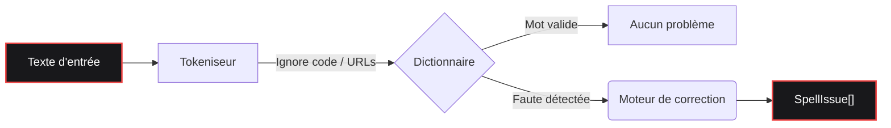

<div align="center">

  <a href="https://www.gohit.xyz/packages/fixnow">
    
  </a>

<br>

<h1></h1>

<br>

<a href="https://www.npmjs.com/package/fixnow"></a>
<a href="https://www.npmjs.com/package/fixnow"></a>
<a href="https://github.com/bastndev/fixnow/blob/main/LICENSE"></a>
<a href="https://github.com/bastndev/fixnow/stargazers"></a>

<h1></h1>

<p >
  <a href="https://github.com/bastndev/fixnow/blob/main/public/docs/README_ES.md">Español 🇪🇸</a> |
  <a href="https://github.com/bastndev/fixnow/blob/main/public/docs/README_ZH.md">中文 🇨🇳</a> |
  <a href="https://github.com/bastndev/fixnow/blob/main/public/docs/README_DE.md">Deutsch 🇩🇪</a> |
  <a href="https://github.com/bastndev/fixnow/blob/main/public/docs/README_FR.md">Français 🇫🇷</a> |
  <a href="https://github.com/bastndev/fixnow/blob/main/public/docs/README_JA.md">日本語 🇯🇵</a> |
  <a href="https://github.com/bastndev/fixnow/blob/main/public/docs/README_KO.md">한국어 🇰🇷</a> |
  <a href="https://github.com/bastndev/fixnow/blob/main/public/docs/README_PT.md">Português 🇧🇷</a> |
  <a href="https://github.com/bastndev/fixnow/blob/main/public/docs/README_RU.md">Русский 🇷🇺</a> |
  <a href="https://github.com/bastndev/fixnow/blob/main/public/docs/README_VI.md">Tiếng Việt 🇻🇳</a> |
  <a href="https://github.com/bastndev/fixnow/blob/main/public/docs/README_HI.md">हिन्दी 🇮🇳</a> |
  <a href="https://github.com/bastndev/fixnow/blob/main/public/docs/README_AR.md">العربية 🇸🇦</a><span>...</span>
</p>

</div>

<br>

> Un minuscule correcteur orthographique multilingue avec suggestions de correction. Les dictionnaires sont inclus, donc `npm i fixnow` vous donne tout — avec **zéro dépendance d'exécution**, à la fois en ESM et en CommonJS.

## Fonctionnalités

- 📦 **Zéro dépendance** — Garde votre `node_modules` propre et léger.
- 🌍 **Dictionnaires intégrés** — Inclut l'arabe, l'allemand, l'anglais, l'espagnol, le français, le portugais, le russe et le vietnamien.
- ⚡ **Builds allégés** — Importez uniquement la langue dont vous avez besoin (p. ex. `import { check } from "fixnow/fr"`) pour optimiser la taille du bundle.
- 🛡️ **Tokenisation intelligente** — Ignore automatiquement les fragments de code, les URLs, les e-mails et les identifiants pour éviter les faux positifs.
- 🧩 **Universel** — Fonctionne parfaitement dans les projets ESM et CommonJS.

## Architecture



## Installation

```bash
npm i fixnow
```

## Langues

| Code | Langue     | Licence du dictionnaire |
| ---- | ---------- | ----------------------- |
| `ar` | Arabe      | LGPL-3.0                |
| `de` | Allemand   | LGPL-3.0                |
| `en` | Anglais    | MIT                     |
| `es` | Espagnol   | LGPL-3.0                |
| `fr` | Français   | MIT                     |
| `pt` | Portugais  | GPL-3.0-or-later        |
| `ru` | Russe      | GPL-3.0-or-later        |
| `vi` | Vietnamien | MIT                     |

## Utilisation

```ts
import { checkText, suggest, createChecker } from "fixnow";

// Anglais
const enIssues = await checkText("This sentance has a typo", {
  language: "en",
  suggestions: true,
});
// -> [{ offset: 5, length: 8, word: 'sentance', suggestions: [...] }]

// Espagnol — activez la tolérance aux accents si vous ne voulez pas que "codigo" soit signalé.
const esIssues = await checkText("Esto es un herror", {
  language: "es",
  suggestions: true,
  acceptAccentOmissions: true,
});
// -> [{ offset: 11, length: 6, word: 'herror', suggestions: [...] }]

// Suggestions de correction ponctuelles
await suggest("bonjoor", { language: "fr" }); // -> ['bonjour', ...]

// Un correcteur lié à une langue
const de = createChecker("de");
await de.isCorrect("Haus"); // -> true
```

CommonJS fonctionne aussi :

```js
const { checkText } = require("fixnow");
```

### API

- `checkText(text, options)` → `Promise<SpellIssue[]>`
- `isCorrect(word, language, options?)` → `Promise<boolean>`
- `suggest(word, { language, max? })` → `Promise<string[]>`
- `createChecker(language)` → lié `{ check, suggest, isCorrect, warmup }`
- `warmup(language?)` — précharger les dictionnaires (éviter le coût de décodage au premier appel)
- `tokenize(text, protectedSegments?)`, `DEFAULT_PROTECTED_PATTERN`
- `SUPPORTED_LANGUAGES`, `LANGUAGES`, `isSupportedLanguage`

**`CheckOptions`:** `language` (requis), `caseSensitive` (false), `acceptAccentOmissions`
(false ; espagnol uniquement), `suggestions`, `maxSuggestions` (5), `minWordLength` (3),
`ignoreWords`, `flagWords`, `isProtectedWord`, `protectedSegments`.

### Tokenisation

`checkText` ignore tout ce qui se trouve dans un « segment protégé » (fragments de code, URLs, e-mails,
chemins, options de CLI, couleurs hex, ACRONYMES, noms de fichiers et identifiants pointés). Remplacez
les motifs avec `protectedSegments` :

```ts
import { checkText, DEFAULT_PROTECTED_PATTERN } from "fixnow";

// Utiliser uniquement votre propre motif
await checkText(text, { language: "en", protectedSegments: /\{\{[^}]+\}\}/g });

// Composer avec celui par défaut
await checkText(text, {
  language: "en",
  protectedSegments: [DEFAULT_PROTECTED_PATTERN, /\{\{[^}]+\}\}/g],
});

// Désactiver entièrement la protection
await checkText(text, { language: "en", protectedSegments: false });
```

La même option est exposée sur `tokenize(text, protectedSegments)`.

### Builds allégés

Si vous n'avez besoin que d'une seule langue, importez-la via le sous-chemin de la langue. Votre bundler
ne copie que le dictionnaire que vous utilisez réellement :

```ts
import { check, suggest } from "fixnow/fr";

const issues = await check("Bonjoor tout le monde", { suggestions: true });
await suggest("bonjoor", 3); // le suggest lié est (word, max?)
```

Les entrées allégées (`fixnow/ar`, `fixnow/de`, `fixnow/en`, `fixnow/es`, `fixnow/fr`,
`fixnow/pt`, `fixnow/ru`, `fixnow/vi`) réexportent un correcteur déjà lié à cette langue.

## Bundling

fixnow lit ses dictionnaires sur le disque à l'exécution — ils sont livrés sous forme de fichiers dans
`node_modules/fixnow/dictionaries/`, et non comme des octets intégrés dans le JS. Tout bundler doit donc
traiter `fixnow` comme **externe**, en le laissant se charger depuis `node_modules` à l'exécution.
C'est obligatoire pour les **extensions VS Code** et tout **bundle CJS** : intégrer fixnow dans une
sortie CJS supprime l'ancre de chemin qu'il utilise pour trouver ses dictionnaires, et il lèvera une
erreur claire « mark 'fixnow' as external » au lieu de les résoudre.

```js
// esbuild
await esbuild.build({
  entryPoints: ["src/extension.ts"],
  bundle: true,
  format: "cjs",
  platform: "node",
  external: ["fixnow"],
});
```

L'option correspondante pour les autres bundlers :

- **Vite** — `build.rollupOptions.external: ['fixnow']`
- **Rollup** — `external: ['fixnow']`
- **webpack** — `externals: { fixnow: 'commonjs fixnow' }`

## Migration depuis 1.x

`2.0.0` corrige trois aspérités de la version extraite de F1. Chacune est un changement incompatible :

- **`language` est désormais requis.** Il n'y a plus de langue par défaut.
  ```ts
  // avant
  await checkText("hola"); // espagnol implicite
  // après
  await checkText("hola", { language: "es" });
  ```
- **`strict` est divisé en `caseSensitive` et `acceptAccentOmissions`.** La nouvelle
  valeur par défaut est stricte (l'ancien `strict: true`). Si vous comptiez sur `strict: false` pour
  tolérer les omissions d'accents en espagnol, activez-le explicitement :
  ```ts
  // avant
  await checkText("codigo", { language: "es" }); // accepté
  // après
  await checkText("codigo", { language: "es", acceptAccentOmissions: true });
  ```
  L'ancienne clé `strict` fonctionne toujours en 2.x avec un `console.warn` ; elle est supprimée dans `3.0.0`.
- **Les marqueurs spécifiques à F1 ont disparu du tokeniseur par défaut.** `[Image #1]`, `[Skills #…]`,
  `/skills #N` et `/skill` ne sont plus ignorés automatiquement. Si vous en avez besoin, passez-les via
  `protectedSegments` :
  ```ts
  const F1_MARKERS = /\[(?:Image|Code|Text) #\d+[^\]\n]*\]|\[Skills? #[^\]\n]+\]|\/skills #\d+|\/skill\b/g;
  await checkText(text, {
    language: "en",
    protectedSegments: [DEFAULT_PROTECTED_PATTERN, F1_MARKERS],
  });
  ```

## Licence

[MIT](../../LICENSE)
