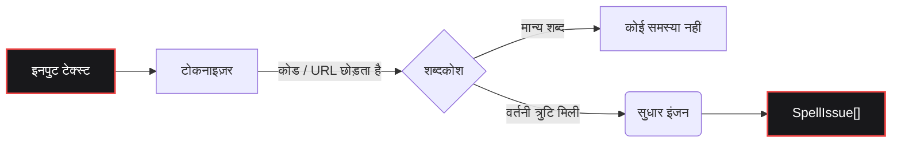

<div align="center">
  <a href="https://github.com/bastndev/fixnow">
    
  </a>

<br>

<h1></h1>

<br>

<a href="https://www.npmjs.com/package/fixnow"></a>
<a href="https://www.npmjs.com/package/fixnow"></a>
<a href="https://github.com/bastndev/fixnow/blob/main/LICENSE"></a>
<a href="https://github.com/bastndev/fixnow/stargazers"></a>

<br>

<p align="center">
  <a href="https://github.com/bastndev/fixnow/blob/main/public/docs/README_ES.md">Español 🇪🇸</a> |
  <a href="https://github.com/bastndev/fixnow/blob/main/public/docs/README_ZH.md">中文 🇨🇳</a> |
  <a href="https://github.com/bastndev/fixnow/blob/main/public/docs/README_DE.md">Deutsch 🇩🇪</a> |
  <a href="https://github.com/bastndev/fixnow/blob/main/public/docs/README_FR.md">Français 🇫🇷</a> |
  <a href="https://github.com/bastndev/fixnow/blob/main/public/docs/README_JA.md">日本語 🇯🇵</a> |
  <a href="https://github.com/bastndev/fixnow/blob/main/public/docs/README_KO.md">한국어 🇰🇷</a> |
  <a href="https://github.com/bastndev/fixnow/blob/main/public/docs/README_PT.md">Português 🇧🇷</a> |
  <a href="https://github.com/bastndev/fixnow/blob/main/public/docs/README_RU.md">Русский 🇷🇺</a> |
  <a href="https://github.com/bastndev/fixnow/blob/main/public/docs/README_VI.md">Tiếng Việt 🇻🇳</a> |
  <a href="https://github.com/bastndev/fixnow/blob/main/public/docs/README_HI.md">हिन्दी 🇮🇳</a> |
  <a href="https://github.com/bastndev/fixnow/blob/main/public/docs/README_AR.md">العربية 🇸🇦</a><span>...</span>
</p>
</div>

<br>

> सुधार सुझावों के साथ एक छोटा बहुभाषी वर्तनी जाँचकर्ता। शब्दकोश बंडल किए गए हैं, इसलिए `npm i fixnow` आपको वह सब कुछ देता है जिसकी आपको आवश्यकता है — ESM और CommonJS दोनों में **शून्य रनटाइम निर्भरता** के साथ।

## विशेषताएँ

- 📦 **शून्य निर्भरता** — आपके `node_modules` को साफ़ और हल्का रखता है।
- 🌍 **अंतर्निहित शब्दकोश** — अरबी, जर्मन, अंग्रेज़ी, स्पेनिश, फ्रेंच, पुर्तगाली, रूसी और वियतनामी शामिल हैं।
- ⚡ **स्लिम बिल्ड** — बंडल आकार को अनुकूलित करने के लिए केवल वही भाषा आयात करें जिसकी आपको आवश्यकता है (उदा. `import { check } from "fixnow/hi"`)।
- 🛡️ **स्मार्ट टोकनाइज़ेशन** — झूठे सकारात्मक रोकने के लिए कोड स्पैन, URL, ईमेल और पहचानकर्ताओं को स्वचालित रूप से अनदेखा करता है।
- 🧩 **सार्वभौमिक** — ESM और CommonJS दोनों प्रोजेक्ट्स में निर्बाध रूप से काम करता है।

## आर्किटेक्चर



## इंस्टालेशन

```bash
npm i fixnow
```

## भाषाएँ

| कोड  | भाषा      | शब्दकोश लाइसेंस   |
| ---- | --------- | ---------------- |
| `ar` | अरबी      | LGPL-3.0         |
| `de` | जर्मन     | LGPL-3.0         |
| `en` | अंग्रेज़ी  | MIT              |
| `es` | स्पेनिश    | LGPL-3.0         |
| `fr` | फ्रेंच     | MIT              |
| `pt` | पुर्तगाली  | GPL-3.0-or-later |
| `ru` | रूसी      | GPL-3.0-or-later |
| `vi` | वियतनामी  | MIT              |

## उपयोग

```ts
import { checkText, suggest, createChecker } from "fixnow";

// अंग्रेज़ी
const enIssues = await checkText("This sentance has a typo", {
  language: "en",
  suggestions: true,
});
// -> [{ offset: 5, length: 8, word: 'sentance', suggestions: [...] }]

// स्पेनिश — यदि आप नहीं चाहते कि "codigo" को चिह्नित किया जाए तो उच्चारण सहिष्णुता सक्षम करें।
const esIssues = await checkText("Esto es un herror", {
  language: "es",
  suggestions: true,
  acceptAccentOmissions: true,
});
// -> [{ offset: 11, length: 6, word: 'herror', suggestions: [...] }]

// एकमुश्त सुधार सुझाव
await suggest("bonjoor", { language: "fr" }); // -> ['bonjour', ...]

// एक भाषा से बंधा हुआ चेकर
const de = createChecker("de");
await de.isCorrect("Haus"); // -> true
```

CommonJS भी काम करता है:

```js
const { checkText } = require("fixnow");
```

### API

- `checkText(text, options)` → `Promise<SpellIssue[]>`
- `isCorrect(word, language, options?)` → `Promise<boolean>`
- `suggest(word, { language, max? })` → `Promise<string[]>`
- `createChecker(language)` → बंधा हुआ `{ check, suggest, isCorrect, warmup }`
- `warmup(language?)` — शब्दकोशों को प्रीलोड करें (पहली कॉल की डिकोड लागत छोड़ें)
- `tokenize(text, protectedSegments?)`, `DEFAULT_PROTECTED_PATTERN`
- `SUPPORTED_LANGUAGES`, `LANGUAGES`, `isSupportedLanguage`

**`CheckOptions`:** `language` (आवश्यक), `caseSensitive` (false), `acceptAccentOmissions`
(false; केवल स्पेनिश), `suggestions`, `maxSuggestions` (5), `minWordLength` (3),
`ignoreWords`, `flagWords`, `isProtectedWord`, `protectedSegments`.

### टोकनाइज़ेशन

`checkText` "संरक्षित खंड" के भीतर की हर चीज़ को छोड़ देता है (कोड स्पैन, URL, ईमेल, पथ, CLI फ़्लैग,
हेक्स रंग, संक्षिप्ताक्षर, फ़ाइल नाम और बिंदु वाले पहचानकर्ता)। पैटर्न को `protectedSegments` से अधिलेखित करें:

```ts
import { checkText, DEFAULT_PROTECTED_PATTERN } from "fixnow";

// केवल अपना स्वयं का पैटर्न उपयोग करें
await checkText(text, { language: "en", protectedSegments: /\{\{[^}]+\}\}/g });

// डिफ़ॉल्ट के साथ संयोजित करें
await checkText(text, {
  language: "en",
  protectedSegments: [DEFAULT_PROTECTED_PATTERN, /\{\{[^}]+\}\}/g],
});

// सुरक्षा को पूरी तरह अक्षम करें
await checkText(text, { language: "en", protectedSegments: false });
```

यही विकल्प `tokenize(text, protectedSegments)` पर भी उपलब्ध है।

### स्लिम बिल्ड

यदि आपको केवल एक भाषा चाहिए, तो उसे भाषा सबपाथ के माध्यम से आयात करें। आपका बंडलर केवल वही शब्दकोश कॉपी
करता है जिसका आप वास्तव में उपयोग करते हैं:

```ts
import { check, suggest } from "fixnow/hi";

const issues = await check("Esto es un herror", { suggestions: true });
await suggest("bonjoor", 3); // बंधा हुआ suggest (word, max?) है
```

स्लिम एंट्रियाँ (`fixnow/ar`, `fixnow/de`, `fixnow/en`, `fixnow/es`, `fixnow/fr`,
`fixnow/pt`, `fixnow/ru`, `fixnow/vi`) उस भाषा से पहले से बंधे एक चेकर को पुनः निर्यात करती हैं।

## बंडलिंग

fixnow रनटाइम पर डिस्क से अपने शब्दकोश पढ़ता है — वे JS में इनलाइन बाइट्स के रूप में नहीं, बल्कि
`node_modules/fixnow/dictionaries/` के अंतर्गत फ़ाइलों के रूप में भेजे जाते हैं। इसलिए किसी भी बंडलर को
`fixnow` को **बाहरी (external)** मानना चाहिए, जिससे यह रनटाइम पर `node_modules` से लोड हो सके। यह
**VS Code एक्सटेंशन** और किसी भी **CJS बंडल** के लिए आवश्यक है: fixnow को CJS आउटपुट में इनलाइन करने से वह
पथ एंकर हट जाता है जिसका उपयोग वह अपने शब्दकोश खोजने के लिए करता है, और उन्हें हल करने के बजाय यह एक
स्पष्ट "mark 'fixnow' as external" त्रुटि फेंकेगा।

```js
// esbuild
await esbuild.build({
  entryPoints: ["src/extension.ts"],
  bundle: true,
  format: "cjs",
  platform: "node",
  external: ["fixnow"],
});
```

अन्य बंडलरों के लिए संगत विकल्प:

- **Vite** — `build.rollupOptions.external: ['fixnow']`
- **Rollup** — `external: ['fixnow']`
- **webpack** — `externals: { fixnow: 'commonjs fixnow' }`

## 1.x से माइग्रेट करना

`2.0.0` F1 से निकाली गई रिलीज़ की तीन खुरदुरी जगहों को साफ़ करता है। प्रत्येक एक ब्रेकिंग बदलाव है:

- **`language` अब आवश्यक है।** अब कोई डिफ़ॉल्ट भाषा नहीं है।
  ```ts
  // पहले
  await checkText("hola"); // अंतर्निहित रूप से स्पेनिश
  // बाद में
  await checkText("hola", { language: "es" });
  ```
- **`strict` को `caseSensitive` और `acceptAccentOmissions` में विभाजित किया गया है।** नया
  डिफ़ॉल्ट सख़्त है (पुराना `strict: true`)। यदि आप स्पेनिश उच्चारण चूक को सहन करने के लिए
  `strict: false` पर निर्भर थे, तो इसे स्पष्ट रूप से सक्षम करें:
  ```ts
  // पहले
  await checkText("codigo", { language: "es" }); // स्वीकृत
  // बाद में
  await checkText("codigo", { language: "es", acceptAccentOmissions: true });
  ```
  लीगेसी `strict` कुंजी 2.x में `console.warn` के साथ अभी भी काम करती है; इसे `3.0.0` में हटा दिया गया है।
- **F1-विशिष्ट मार्कर डिफ़ॉल्ट टोकनाइज़र से हटा दिए गए हैं।** `[Image #1]`, `[Skills #…]`,
  `/skills #N` और `/skill` अब स्वचालित रूप से नहीं छूटते। यदि आपको इनकी आवश्यकता हो, तो इन्हें
  `protectedSegments` के माध्यम से पास करें:
  ```ts
  const F1_MARKERS = /\[(?:Image|Code|Text) #\d+[^\]\n]*\]|\[Skills? #[^\]\n]+\]|\/skills #\d+|\/skill\b/g;
  await checkText(text, {
    language: "en",
    protectedSegments: [DEFAULT_PROTECTED_PATTERN, F1_MARKERS],
  });
  ```

## लाइसेंस

[MIT](../../LICENSE)
