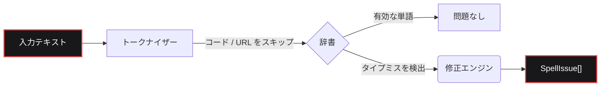

<div align="center">
  <a href="https://github.com/bastndev/fixnow">
    
  </a>

<br>

<h1></h1>

<br>

<a href="https://www.npmjs.com/package/fixnow"></a>
<a href="https://www.npmjs.com/package/fixnow"></a>
<a href="https://github.com/bastndev/fixnow/blob/main/LICENSE"></a>
<a href="https://github.com/bastndev/fixnow/stargazers"></a>

<br>

<p align="center">
  <a href="https://github.com/bastndev/fixnow/blob/main/public/docs/README_ES.md">Español 🇪🇸</a> |
  <a href="https://github.com/bastndev/fixnow/blob/main/public/docs/README_ZH.md">中文 🇨🇳</a> |
  <a href="https://github.com/bastndev/fixnow/blob/main/public/docs/README_DE.md">Deutsch 🇩🇪</a> |
  <a href="https://github.com/bastndev/fixnow/blob/main/public/docs/README_FR.md">Français 🇫🇷</a> |
  <a href="https://github.com/bastndev/fixnow/blob/main/public/docs/README_JA.md">日本語 🇯🇵</a> |
  <a href="https://github.com/bastndev/fixnow/blob/main/public/docs/README_KO.md">한국어 🇰🇷</a> |
  <a href="https://github.com/bastndev/fixnow/blob/main/public/docs/README_PT.md">Português 🇧🇷</a> |
  <a href="https://github.com/bastndev/fixnow/blob/main/public/docs/README_RU.md">Русский 🇷🇺</a> |
  <a href="https://github.com/bastndev/fixnow/blob/main/public/docs/README_VI.md">Tiếng Việt 🇻🇳</a> |
  <a href="https://github.com/bastndev/fixnow/blob/main/public/docs/README_HI.md">हिन्दी 🇮🇳</a> |
  <a href="https://github.com/bastndev/fixnow/blob/main/public/docs/README_AR.md">العربية 🇸🇦</a><span>...</span>
</p>
</div>

<br>

> 修正提案機能付きの小さな多言語スペルチェッカー。辞書がバンドルされているため、`npm i fixnow` だけで必要なものがすべて揃います — ESM と CommonJS の両方で、**実行時依存関係はゼロ**です。

## 特徴

- 📦 **依存関係ゼロ** — `node_modules` をクリーンかつ軽量に保ちます。
- 🌍 **組み込み辞書** — アラビア語、ドイツ語、英語、スペイン語、フランス語、ポルトガル語、ロシア語、ベトナム語を収録。
- ⚡ **スリムなビルド** — 必要な言語だけをインポートして（例: `import { check } from "fixnow/ja"`）バンドルサイズを最適化できます。
- 🛡️ **スマートなトークン化** — コードスパン、URL、メール、識別子を自動的に無視し、誤検知を防ぎます。
- 🧩 **ユニバーサル** — ESM と CommonJS の両方のプロジェクトでシームレスに動作します。

## アーキテクチャ



## インストール

```bash
npm i fixnow
```

## 言語

| コード | 言語         | 辞書ライセンス   |
| ------ | ------------ | ---------------- |
| `ar`   | アラビア語   | LGPL-3.0         |
| `de`   | ドイツ語     | LGPL-3.0         |
| `en`   | 英語         | MIT              |
| `es`   | スペイン語   | LGPL-3.0         |
| `fr`   | フランス語   | MIT              |
| `pt`   | ポルトガル語 | GPL-3.0-or-later |
| `ru`   | ロシア語     | GPL-3.0-or-later |
| `vi`   | ベトナム語   | MIT              |

## 使い方

```ts
import { checkText, suggest, createChecker } from "fixnow";

// 英語
const enIssues = await checkText("This sentance has a typo", {
  language: "en",
  suggestions: true,
});
// -> [{ offset: 5, length: 8, word: 'sentance', suggestions: [...] }]

// スペイン語 — "codigo" をフラグしたくない場合はアクセントの寛容性を有効にします。
const esIssues = await checkText("Esto es un herror", {
  language: "es",
  suggestions: true,
  acceptAccentOmissions: true,
});
// -> [{ offset: 11, length: 6, word: 'herror', suggestions: [...] }]

// 1回限りの修正提案
await suggest("bonjoor", { language: "fr" }); // -> ['bonjour', ...]

// 1つの言語にバインドされたチェッカー
const de = createChecker("de");
await de.isCorrect("Haus"); // -> true
```

CommonJS も動作します：

```js
const { checkText } = require("fixnow");
```

### API

- `checkText(text, options)` → `Promise<SpellIssue[]>`
- `isCorrect(word, language, options?)` → `Promise<boolean>`
- `suggest(word, { language, max? })` → `Promise<string[]>`
- `createChecker(language)` → バインド済み `{ check, suggest, isCorrect, warmup }`
- `warmup(language?)` — 辞書をプリロードする（初回呼び出し時のデコードコストをスキップ）
- `tokenize(text, protectedSegments?)`、`DEFAULT_PROTECTED_PATTERN`
- `SUPPORTED_LANGUAGES`、`LANGUAGES`、`isSupportedLanguage`

**`CheckOptions`:** `language`（必須）、`caseSensitive`（false）、`acceptAccentOmissions`
（false; スペイン語のみ）、`suggestions`、`maxSuggestions`（5）、`minWordLength`（3）、
`ignoreWords`、`flagWords`、`isProtectedWord`、`protectedSegments`。

### トークン化

`checkText` は「保護されたセグメント」内のもの（コードスパン、URL、メール、パス、CLI フラグ、16進数カラー、
頭字語、ファイル名、ドット付き識別子）をすべてスキップします。`protectedSegments` でパターンを上書きできます:

```ts
import { checkText, DEFAULT_PROTECTED_PATTERN } from "fixnow";

// 独自のパターンのみを使用
await checkText(text, { language: "en", protectedSegments: /\{\{[^}]+\}\}/g });

// デフォルトと組み合わせる
await checkText(text, {
  language: "en",
  protectedSegments: [DEFAULT_PROTECTED_PATTERN, /\{\{[^}]+\}\}/g],
});

// 保護を完全に無効化
await checkText(text, { language: "en", protectedSegments: false });
```

同じオプションは `tokenize(text, protectedSegments)` でも公開されています。

### スリムなビルド

1つの言語だけが必要な場合は、その言語のサブパス経由でインポートします。バンドラーは実際に使用する辞書のみを
コピーします:

```ts
import { check, suggest } from "fixnow/ja";

const issues = await check("Esto es un herror", { suggestions: true });
await suggest("bonjoor", 3); // バインドされた suggest は (word, max?)
```

スリムなエントリ（`fixnow/ar`、`fixnow/de`、`fixnow/en`、`fixnow/es`、`fixnow/fr`、
`fixnow/pt`、`fixnow/ru`、`fixnow/vi`）は、その言語にあらかじめバインドされたチェッカーを再エクスポートします。

## バンドリング

fixnow は実行時にディスクから辞書を読み込みます — それらは JS に埋め込まれたバイトではなく、
`node_modules/fixnow/dictionaries/` 配下のファイルとして配布されます。そのため、どのバンドラーも
`fixnow` を **external** として扱い、実行時に `node_modules` から読み込ませる必要があります。
これは **VS Code 拡張機能**やあらゆる **CJS バンドル**で必須です: fixnow を CJS 出力にインライン化すると、
辞書を見つけるために使用するパスアンカーが失われ、それらを解決する代わりに
「mark 'fixnow' as external」という明確なエラーをスローします。

```js
// esbuild
await esbuild.build({
  entryPoints: ["src/extension.ts"],
  bundle: true,
  format: "cjs",
  platform: "node",
  external: ["fixnow"],
});
```

他のバンドラーでの対応オプション:

- **Vite** — `build.rollupOptions.external: ['fixnow']`
- **Rollup** — `external: ['fixnow']`
- **webpack** — `externals: { fixnow: 'commonjs fixnow' }`

## 1.x からの移行

`2.0.0` は F1 から抽出したリリースの 3 つの粗い点を整理します。それぞれが破壊的変更です:

- **`language` が必須になりました。** デフォルト言語はもうありません。
  ```ts
  // 以前
  await checkText("hola"); // 暗黙的にスペイン語
  // 以後
  await checkText("hola", { language: "es" });
  ```
- **`strict` が `caseSensitive` と `acceptAccentOmissions` に分割されました。** 新しい
  デフォルトは厳格モード（以前の `strict: true`）です。スペイン語のアクセント省略を許容するために
  `strict: false` に依存していた場合は、明示的に有効化してください:
  ```ts
  // 以前
  await checkText("codigo", { language: "es" }); // 受理
  // 以後
  await checkText("codigo", { language: "es", acceptAccentOmissions: true });
  ```
  レガシーの `strict` キーは 2.x では `console.warn` 付きで引き続き機能します。`3.0.0` で削除されます。
- **F1 固有のマーカーがデフォルトのトークナイザーから削除されました。** `[Image #1]`、`[Skills #…]`、
  `/skills #N`、`/skill` は自動スキップされなくなりました。必要な場合は
  `protectedSegments` 経由で渡してください:
  ```ts
  const F1_MARKERS = /\[(?:Image|Code|Text) #\d+[^\]\n]*\]|\[Skills? #[^\]\n]+\]|\/skills #\d+|\/skill\b/g;
  await checkText(text, {
    language: "en",
    protectedSegments: [DEFAULT_PROTECTED_PATTERN, F1_MARKERS],
  });
  ```

## ライセンス

[MIT](../../LICENSE)
