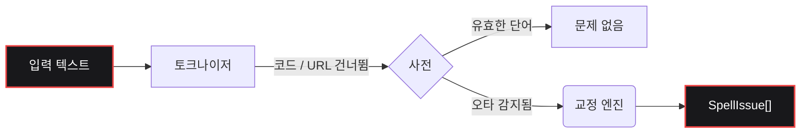

<div align="center">
  <a href="https://github.com/bastndev/fixnow">
    
  </a>

<br>

<h1></h1>

<br>

<a href="https://www.npmjs.com/package/fixnow"></a>
<a href="https://www.npmjs.com/package/fixnow"></a>
<a href="https://github.com/bastndev/fixnow/blob/main/LICENSE"></a>
<a href="https://github.com/bastndev/fixnow/stargazers"></a>

<br>

<p align="center">
  <a href="https://github.com/bastndev/fixnow/blob/main/public/docs/README_ES.md">Español 🇪🇸</a> |
  <a href="https://github.com/bastndev/fixnow/blob/main/public/docs/README_ZH.md">中文 🇨🇳</a> |
  <a href="https://github.com/bastndev/fixnow/blob/main/public/docs/README_DE.md">Deutsch 🇩🇪</a> |
  <a href="https://github.com/bastndev/fixnow/blob/main/public/docs/README_FR.md">Français 🇫🇷</a> |
  <a href="https://github.com/bastndev/fixnow/blob/main/public/docs/README_JA.md">日本語 🇯🇵</a> |
  <a href="https://github.com/bastndev/fixnow/blob/main/public/docs/README_KO.md">한국어 🇰🇷</a> |
  <a href="https://github.com/bastndev/fixnow/blob/main/public/docs/README_PT.md">Português 🇧🇷</a> |
  <a href="https://github.com/bastndev/fixnow/blob/main/public/docs/README_RU.md">Русский 🇷🇺</a> |
  <a href="https://github.com/bastndev/fixnow/blob/main/public/docs/README_VI.md">Tiếng Việt 🇻🇳</a> |
  <a href="https://github.com/bastndev/fixnow/blob/main/public/docs/README_HI.md">हिन्दी 🇮🇳</a> |
  <a href="https://github.com/bastndev/fixnow/blob/main/public/docs/README_AR.md">العربية 🇸🇦</a><span>...</span>
</p>
</div>

<br>

> 교정 제안 기능이 있는 작은 다국어 맞춤법 검사기. 사전이 번들로 제공되므로 `npm i fixnow` 만으로 필요한 모든 것을 얻을 수 있습니다 — ESM과 CommonJS 양쪽 모두에서 **런타임 종속성 제로**입니다.

## 특징

- 📦 **종속성 제로** — `node_modules`를 깔끔하고 가볍게 유지합니다.
- 🌍 **내장 사전** — 아랍어, 독일어, 영어, 스페인어, 프랑스어, 포르투갈어, 러시아어, 베트남어를 포함합니다.
- ⚡ **슬림 빌드** — 필요한 언어만 가져와서(예: `import { check } from "fixnow/ko"`) 번들 크기를 최적화합니다.
- 🛡️ **스마트 토큰화** — 코드 스팬, URL, 이메일, 식별자를 자동으로 무시하여 오탐을 방지합니다.
- 🧩 **범용** — ESM과 CommonJS 프로젝트 모두에서 매끄럽게 동작합니다.

## 아키텍처



## 설치

```bash
npm i fixnow
```

## 언어

| 코드 | 언어       | 사전 라이선스    |
| ---- | ---------- | ---------------- |
| `ar` | 아랍어     | LGPL-3.0         |
| `de` | 독일어     | LGPL-3.0         |
| `en` | 영어       | MIT              |
| `es` | 스페인어   | LGPL-3.0         |
| `fr` | 프랑스어   | MIT              |
| `pt` | 포르투갈어 | GPL-3.0-or-later |
| `ru` | 러시아어   | GPL-3.0-or-later |
| `vi` | 베트남어   | MIT              |

## 사용법

```ts
import { checkText, suggest, createChecker } from "fixnow";

// 영어
const enIssues = await checkText("This sentance has a typo", {
  language: "en",
  suggestions: true,
});
// -> [{ offset: 5, length: 8, word: 'sentance', suggestions: [...] }]

// 스페인어 — "codigo"가 표시되지 않게 하려면 악센트 관용 옵션을 켜세요.
const esIssues = await checkText("Esto es un herror", {
  language: "es",
  suggestions: true,
  acceptAccentOmissions: true,
});
// -> [{ offset: 11, length: 6, word: 'herror', suggestions: [...] }]

// 일회성 교정 제안
await suggest("bonjoor", { language: "fr" }); // -> ['bonjour', ...]

// 하나의 언어에 바인딩된 검사기
const de = createChecker("de");
await de.isCorrect("Haus"); // -> true
```

CommonJS에서도 작동합니다:

```js
const { checkText } = require("fixnow");
```

### API

- `checkText(text, options)` → `Promise<SpellIssue[]>`
- `isCorrect(word, language, options?)` → `Promise<boolean>`
- `suggest(word, { language, max? })` → `Promise<string[]>`
- `createChecker(language)` → 바인딩된 `{ check, suggest, isCorrect, warmup }`
- `warmup(language?)` — 사전 미리 로드 (첫 호출 디코딩 비용 건너뛰기)
- `tokenize(text, protectedSegments?)`, `DEFAULT_PROTECTED_PATTERN`
- `SUPPORTED_LANGUAGES`, `LANGUAGES`, `isSupportedLanguage`

**`CheckOptions`:** `language` (필수), `caseSensitive` (false), `acceptAccentOmissions`
(false; 스페인어 전용), `suggestions`, `maxSuggestions` (5), `minWordLength` (3),
`ignoreWords`, `flagWords`, `isProtectedWord`, `protectedSegments`.

### 토큰화

`checkText`는 "보호된 세그먼트"(코드 스팬, URL, 이메일, 경로, CLI 플래그, 16진수 색상, 약어, 파일 이름,
점이 포함된 식별자) 안에 있는 모든 것을 건너뜁니다. `protectedSegments`로 패턴을 재정의하세요:

```ts
import { checkText, DEFAULT_PROTECTED_PATTERN } from "fixnow";

// 자신의 패턴만 사용
await checkText(text, { language: "en", protectedSegments: /\{\{[^}]+\}\}/g });

// 기본값과 함께 구성
await checkText(text, {
  language: "en",
  protectedSegments: [DEFAULT_PROTECTED_PATTERN, /\{\{[^}]+\}\}/g],
});

// 보호 완전히 비활성화
await checkText(text, { language: "en", protectedSegments: false });
```

동일한 옵션이 `tokenize(text, protectedSegments)`에도 노출됩니다.

### 슬림 빌드

하나의 언어만 필요하다면 해당 언어의 서브경로로 가져오세요. 번들러는 실제로 사용하는 사전만 복사합니다:

```ts
import { check, suggest } from "fixnow/ko";

const issues = await check("Esto es un herror", { suggestions: true });
await suggest("bonjoor", 3); // 바인딩된 suggest는 (word, max?) 형태
```

슬림 엔트리(`fixnow/ar`, `fixnow/de`, `fixnow/en`, `fixnow/es`, `fixnow/fr`,
`fixnow/pt`, `fixnow/ru`, `fixnow/vi`)는 해당 언어에 미리 바인딩된 검사기를 다시 내보냅니다.

## 번들링

fixnow는 런타임에 디스크에서 사전을 읽습니다 — 사전은 JS에 인라인된 바이트가 아니라
`node_modules/fixnow/dictionaries/` 아래의 파일로 제공됩니다. 따라서 모든 번들러는 `fixnow`를
**외부(external)**로 처리하여 런타임에 `node_modules`에서 로드하도록 해야 합니다. 이는
**VS Code 확장**과 모든 **CJS 번들**에 필수입니다: fixnow를 CJS 출력에 인라인하면 사전을 찾는 데
사용하는 경로 앵커가 제거되어, 사전을 해석하는 대신 "mark 'fixnow' as external"이라는 명확한 오류를
던집니다.

```js
// esbuild
await esbuild.build({
  entryPoints: ["src/extension.ts"],
  bundle: true,
  format: "cjs",
  platform: "node",
  external: ["fixnow"],
});
```

다른 번들러의 해당 옵션:

- **Vite** — `build.rollupOptions.external: ['fixnow']`
- **Rollup** — `external: ['fixnow']`
- **webpack** — `externals: { fixnow: 'commonjs fixnow' }`

## 1.x에서 마이그레이션

`2.0.0`은 F1에서 추출한 릴리스의 거친 부분 세 가지를 정리합니다. 각각은 호환성을 깨는 변경입니다:

- **`language`가 이제 필수입니다.** 더 이상 기본 언어가 없습니다.
  ```ts
  // 이전
  await checkText("hola"); // 암묵적으로 스페인어
  // 이후
  await checkText("hola", { language: "es" });
  ```
- **`strict`가 `caseSensitive`와 `acceptAccentOmissions`로 분리되었습니다.** 새로운
  기본값은 엄격(기존의 `strict: true`)입니다. 스페인어 악센트 생략을 허용하기 위해
  `strict: false`에 의존했다면 명시적으로 켜세요:
  ```ts
  // 이전
  await checkText("codigo", { language: "es" }); // 허용됨
  // 이후
  await checkText("codigo", { language: "es", acceptAccentOmissions: true });
  ```
  레거시 `strict` 키는 2.x에서 `console.warn`과 함께 계속 작동하며, `3.0.0`에서 제거됩니다.
- **F1 전용 마커가 기본 토크나이저에서 제거되었습니다.** `[Image #1]`, `[Skills #…]`,
  `/skills #N`, `/skill`은 더 이상 자동으로 건너뛰지 않습니다. 필요하다면
  `protectedSegments`로 전달하세요:
  ```ts
  const F1_MARKERS = /\[(?:Image|Code|Text) #\d+[^\]\n]*\]|\[Skills? #[^\]\n]+\]|\/skills #\d+|\/skill\b/g;
  await checkText(text, {
    language: "en",
    protectedSegments: [DEFAULT_PROTECTED_PATTERN, F1_MARKERS],
  });
  ```

## 라이선스

[MIT](../../LICENSE)
