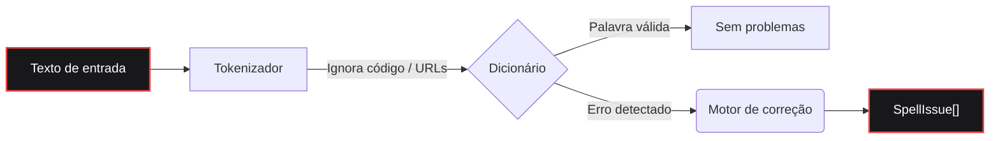

<div align="center">
  <a href="https://github.com/bastndev/fixnow">
    
  </a>

<br>

<h1></h1>

<br>

<a href="https://www.npmjs.com/package/fixnow"></a>
<a href="https://www.npmjs.com/package/fixnow"></a>
<a href="https://github.com/bastndev/fixnow/blob/main/LICENSE"></a>
<a href="https://github.com/bastndev/fixnow/stargazers"></a>

<br>

<p align="center">
  <a href="https://github.com/bastndev/fixnow/blob/main/public/docs/README_ES.md">Español 🇪🇸</a> |
  <a href="https://github.com/bastndev/fixnow/blob/main/public/docs/README_ZH.md">中文 🇨🇳</a> |
  <a href="https://github.com/bastndev/fixnow/blob/main/public/docs/README_DE.md">Deutsch 🇩🇪</a> |
  <a href="https://github.com/bastndev/fixnow/blob/main/public/docs/README_FR.md">Français 🇫🇷</a> |
  <a href="https://github.com/bastndev/fixnow/blob/main/public/docs/README_JA.md">日本語 🇯🇵</a> |
  <a href="https://github.com/bastndev/fixnow/blob/main/public/docs/README_KO.md">한국어 🇰🇷</a> |
  <a href="https://github.com/bastndev/fixnow/blob/main/public/docs/README_PT.md">Português 🇧🇷</a> |
  <a href="https://github.com/bastndev/fixnow/blob/main/public/docs/README_RU.md">Русский 🇷🇺</a> |
  <a href="https://github.com/bastndev/fixnow/blob/main/public/docs/README_VI.md">Tiếng Việt 🇻🇳</a> |
  <a href="https://github.com/bastndev/fixnow/blob/main/public/docs/README_HI.md">हिन्दी 🇮🇳</a> |
  <a href="https://github.com/bastndev/fixnow/blob/main/public/docs/README_AR.md">العربية 🇸🇦</a><span>...</span>
</p>
</div>

<br>

> Um pequeno corretor ortográfico multilíngue com sugestões de correção. Os dicionários vêm incluídos, então `npm i fixnow` te dá tudo o que você precisa — com **zero dependências em tempo de execução**, tanto em ESM quanto em CommonJS.

## Recursos

- 📦 **Zero dependências** — Mantém seu `node_modules` limpo e leve.
- 🌍 **Dicionários integrados** — Inclui árabe, alemão, inglês, espanhol, francês, português, russo e vietnamita.
- ⚡ **Builds enxutos** — Importe apenas o idioma de que você precisa (ex.: `import { check } from "fixnow/pt"`) para otimizar o tamanho do bundle.
- 🛡️ **Tokenização inteligente** — Ignora automaticamente trechos de código, URLs, e-mails e identificadores para evitar falsos positivos.
- 🧩 **Universal** — Funciona perfeitamente em projetos ESM e CommonJS.

## Arquitetura



## Instalação

```bash
npm i fixnow
```

## Idiomas

| Código | Idioma     | Licença do dicionário |
| ------ | ---------- | --------------------- |
| `ar`   | Árabe      | LGPL-3.0              |
| `de`   | Alemão     | LGPL-3.0              |
| `en`   | Inglês     | MIT                   |
| `es`   | Espanhol   | LGPL-3.0              |
| `fr`   | Francês    | MIT                   |
| `pt`   | Português  | GPL-3.0-or-later      |
| `ru`   | Russo      | GPL-3.0-or-later      |
| `vi`   | Vietnamita | MIT                   |

## Uso

```ts
import { checkText, suggest, createChecker } from "fixnow";

// Inglês
const enIssues = await checkText("This sentance has a typo", {
  language: "en",
  suggestions: true,
});
// -> [{ offset: 5, length: 8, word: 'sentance', suggestions: [...] }]

// Espanhol — ative a tolerância a acentos se não quiser que "codigo" seja sinalizado.
const esIssues = await checkText("Esto es un herror", {
  language: "es",
  suggestions: true,
  acceptAccentOmissions: true,
});
// -> [{ offset: 11, length: 6, word: 'herror', suggestions: [...] }]

// Sugestões de correção pontuais
await suggest("bonjoor", { language: "fr" }); // -> ['bonjour', ...]

// Um corretor vinculado a um idioma
const de = createChecker("de");
await de.isCorrect("Haus"); // -> true
```

CommonJS também funciona:

```js
const { checkText } = require("fixnow");
```

### API

- `checkText(text, options)` → `Promise<SpellIssue[]>`
- `isCorrect(word, language, options?)` → `Promise<boolean>`
- `suggest(word, { language, max? })` → `Promise<string[]>`
- `createChecker(language)` → vinculado `{ check, suggest, isCorrect, warmup }`
- `warmup(language?)` — pré-carregar dicionários (evita o custo de decodificação na primeira chamada)
- `tokenize(text, protectedSegments?)`, `DEFAULT_PROTECTED_PATTERN`
- `SUPPORTED_LANGUAGES`, `LANGUAGES`, `isSupportedLanguage`

**`CheckOptions`:** `language` (obrigatório), `caseSensitive` (false), `acceptAccentOmissions`
(false; apenas espanhol), `suggestions`, `maxSuggestions` (5), `minWordLength` (3),
`ignoreWords`, `flagWords`, `isProtectedWord`, `protectedSegments`.

### Tokenização

`checkText` ignora tudo o que estiver dentro de um "segmento protegido" (trechos de código, URLs,
e-mails, caminhos, flags de CLI, cores hex, ACRÔNIMOS, nomes de arquivo e identificadores com ponto).
Substitua os padrões com `protectedSegments`:

```ts
import { checkText, DEFAULT_PROTECTED_PATTERN } from "fixnow";

// Usar apenas seu próprio padrão
await checkText(text, { language: "en", protectedSegments: /\{\{[^}]+\}\}/g });

// Compor com o padrão
await checkText(text, {
  language: "en",
  protectedSegments: [DEFAULT_PROTECTED_PATTERN, /\{\{[^}]+\}\}/g],
});

// Desativar a proteção por completo
await checkText(text, { language: "en", protectedSegments: false });
```

A mesma opção está exposta em `tokenize(text, protectedSegments)`.

### Builds enxutos

Se você precisar de apenas um idioma, importe-o pelo subcaminho do idioma. Seu bundler copia apenas o
dicionário que você realmente usa:

```ts
import { check, suggest } from "fixnow/pt";

const issues = await check("Isto é um eroo", { suggestions: true });
await suggest("bonjoor", 3); // o suggest vinculado é (word, max?)
```

As entradas enxutas (`fixnow/ar`, `fixnow/de`, `fixnow/en`, `fixnow/es`, `fixnow/fr`,
`fixnow/pt`, `fixnow/ru`, `fixnow/vi`) reexportam um corretor já vinculado a esse idioma.

## Bundling

O fixnow lê seus dicionários do disco em tempo de execução — eles são distribuídos como arquivos em
`node_modules/fixnow/dictionaries/`, não como bytes embutidos no JS. Por isso, qualquer bundler deve
tratar `fixnow` como **externo**, deixando-o carregar a partir de `node_modules` em tempo de execução.
Isso é obrigatório para **extensões do VS Code** e qualquer **bundle CJS**: embutir o fixnow em uma
saída CJS remove a âncora de caminho que ele usa para encontrar seus dicionários, e ele lançará um erro
claro "mark 'fixnow' as external" em vez de resolvê-los.

```js
// esbuild
await esbuild.build({
  entryPoints: ["src/extension.ts"],
  bundle: true,
  format: "cjs",
  platform: "node",
  external: ["fixnow"],
});
```

A opção correspondente para outros bundlers:

- **Vite** — `build.rollupOptions.external: ['fixnow']`
- **Rollup** — `external: ['fixnow']`
- **webpack** — `externals: { fixnow: 'commonjs fixnow' }`

## Migrando da 1.x

A `2.0.0` corrige três arestas da versão extraída do F1. Cada uma é uma mudança incompatível:

- **`language` agora é obrigatório.** Não há mais um idioma padrão.
  ```ts
  // antes
  await checkText("hola"); // espanhol implícito
  // depois
  await checkText("hola", { language: "es" });
  ```
- **`strict` foi dividido em `caseSensitive` e `acceptAccentOmissions`.** O novo
  padrão é estrito (o antigo `strict: true`). Se você dependia de `strict: false` para
  tolerar omissões de acentos em espanhol, ative isso explicitamente:
  ```ts
  // antes
  await checkText("codigo", { language: "es" }); // aceito
  // depois
  await checkText("codigo", { language: "es", acceptAccentOmissions: true });
  ```
  A chave legada `strict` ainda funciona na 2.x com um `console.warn`; ela é removida na `3.0.0`.
- **Os marcadores específicos do F1 saíram do tokenizador padrão.** `[Image #1]`, `[Skills #…]`,
  `/skills #N` e `/skill` não são mais ignorados automaticamente. Se você precisar deles, passe-os via
  `protectedSegments`:
  ```ts
  const F1_MARKERS = /\[(?:Image|Code|Text) #\d+[^\]\n]*\]|\[Skills? #[^\]\n]+\]|\/skills #\d+|\/skill\b/g;
  await checkText(text, {
    language: "en",
    protectedSegments: [DEFAULT_PROTECTED_PATTERN, F1_MARKERS],
  });
  ```

## Licença

[MIT](../../LICENSE)
