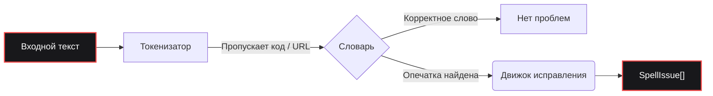

<div align="center">
  <a href="https://github.com/bastndev/fixnow">
    
  </a>

<br>

<h1></h1>

<br>

<a href="https://www.npmjs.com/package/fixnow"></a>
<a href="https://www.npmjs.com/package/fixnow"></a>
<a href="https://github.com/bastndev/fixnow/blob/main/LICENSE"></a>
<a href="https://github.com/bastndev/fixnow/stargazers"></a>

<br>

<p align="center">
  <a href="https://github.com/bastndev/fixnow/blob/main/public/docs/README_ES.md">Español 🇪🇸</a> |
  <a href="https://github.com/bastndev/fixnow/blob/main/public/docs/README_ZH.md">中文 🇨🇳</a> |
  <a href="https://github.com/bastndev/fixnow/blob/main/public/docs/README_DE.md">Deutsch 🇩🇪</a> |
  <a href="https://github.com/bastndev/fixnow/blob/main/public/docs/README_FR.md">Français 🇫🇷</a> |
  <a href="https://github.com/bastndev/fixnow/blob/main/public/docs/README_JA.md">日本語 🇯🇵</a> |
  <a href="https://github.com/bastndev/fixnow/blob/main/public/docs/README_KO.md">한국어 🇰🇷</a> |
  <a href="https://github.com/bastndev/fixnow/blob/main/public/docs/README_PT.md">Português 🇧🇷</a> |
  <a href="https://github.com/bastndev/fixnow/blob/main/public/docs/README_RU.md">Русский 🇷🇺</a> |
  <a href="https://github.com/bastndev/fixnow/blob/main/public/docs/README_VI.md">Tiếng Việt 🇻🇳</a> |
  <a href="https://github.com/bastndev/fixnow/blob/main/public/docs/README_HI.md">हिन्दी 🇮🇳</a> |
  <a href="https://github.com/bastndev/fixnow/blob/main/public/docs/README_AR.md">العربية 🇸🇦</a><span>...</span>
</p>
</div>

<br>

> Крошечная многоязычная программа проверки орфографии с предложениями по исправлению. Словари включены в комплект, поэтому `npm i fixnow` дает вам всё необходимое — **без зависимостей во время выполнения**, как в ESM, так и в CommonJS.

## Возможности

- 📦 **Ноль зависимостей** — Сохраняет ваш `node_modules` чистым и лёгким.
- 🌍 **Встроенные словари** — Включает арабский, немецкий, английский, испанский, французский, португальский, русский и вьетнамский.
- ⚡ **Облегчённые сборки** — Импортируйте только нужный язык (например, `import { check } from "fixnow/ru"`), чтобы оптимизировать размер бандла.
- 🛡️ **Умная токенизация** — Автоматически пропускает фрагменты кода, URL, адреса электронной почты и идентификаторы, чтобы избежать ложных срабатываний.
- 🧩 **Универсальность** — Безупречно работает в проектах как ESM, так и CommonJS.

## Архитектура



## Установка

```bash
npm i fixnow
```

## Языки

| Код  | Язык          | Лицензия словаря |
| ---- | ------------- | ---------------- |
| `ar` | Арабский      | LGPL-3.0         |
| `de` | Немецкий      | LGPL-3.0         |
| `en` | Английский    | MIT              |
| `es` | Испанский     | LGPL-3.0         |
| `fr` | Французский   | MIT              |
| `pt` | Португальский | GPL-3.0-or-later |
| `ru` | Русский       | GPL-3.0-or-later |
| `vi` | Вьетнамский   | MIT              |

## Использование

```ts
import { checkText, suggest, createChecker } from "fixnow";

// Английский
const enIssues = await checkText("This sentance has a typo", {
  language: "en",
  suggestions: true,
});
// -> [{ offset: 5, length: 8, word: 'sentance', suggestions: [...] }]

// Испанский — включите снисходительность к ударениям, если не хотите, чтобы "codigo" помечалось.
const esIssues = await checkText("Esto es un herror", {
  language: "es",
  suggestions: true,
  acceptAccentOmissions: true,
});
// -> [{ offset: 11, length: 6, word: 'herror', suggestions: [...] }]

// Разовые предложения по исправлению
await suggest("bonjoor", { language: "fr" }); // -> ['bonjour', ...]

// Проверка, привязанная к одному языку
const de = createChecker("de");
await de.isCorrect("Haus"); // -> true
```

CommonJS тоже работает:

```js
const { checkText } = require("fixnow");
```

### API

- `checkText(text, options)` → `Promise<SpellIssue[]>`
- `isCorrect(word, language, options?)` → `Promise<boolean>`
- `suggest(word, { language, max? })` → `Promise<string[]>`
- `createChecker(language)` → привязанный `{ check, suggest, isCorrect, warmup }`
- `warmup(language?)` — предварительная загрузка словарей (пропуск затрат на декодирование при первом вызове)
- `tokenize(text, protectedSegments?)`, `DEFAULT_PROTECTED_PATTERN`
- `SUPPORTED_LANGUAGES`, `LANGUAGES`, `isSupportedLanguage`

**`CheckOptions`:** `language` (обязательно), `caseSensitive` (false), `acceptAccentOmissions`
(false; только испанский), `suggestions`, `maxSuggestions` (5), `minWordLength` (3),
`ignoreWords`, `flagWords`, `isProtectedWord`, `protectedSegments`.

### Токенизация

`checkText` пропускает всё, что находится внутри «защищённого сегмента» (фрагменты кода, URL, адреса
электронной почты, пути, флаги CLI, hex-цвета, АКРОНИМЫ, имена файлов и идентификаторы с точками).
Переопределите шаблоны с помощью `protectedSegments`:

```ts
import { checkText, DEFAULT_PROTECTED_PATTERN } from "fixnow";

// Использовать только свой шаблон
await checkText(text, { language: "en", protectedSegments: /\{\{[^}]+\}\}/g });

// Объединить со стандартным
await checkText(text, {
  language: "en",
  protectedSegments: [DEFAULT_PROTECTED_PATTERN, /\{\{[^}]+\}\}/g],
});

// Полностью отключить защиту
await checkText(text, { language: "en", protectedSegments: false });
```

Та же опция доступна в `tokenize(text, protectedSegments)`.

### Облегчённые сборки

Если вам нужен только один язык, импортируйте его через подпуть языка. Ваш бандлер скопирует только тот
словарь, который вы действительно используете:

```ts
import { check, suggest } from "fixnow/ru";

const issues = await check("Это праверка текста", { suggestions: true });
await suggest("bonjoor", 3); // привязанный suggest имеет вид (word, max?)
```

Облегчённые точки входа (`fixnow/ar`, `fixnow/de`, `fixnow/en`, `fixnow/es`, `fixnow/fr`,
`fixnow/pt`, `fixnow/ru`, `fixnow/vi`) реэкспортируют проверку, уже привязанную к этому языку.

## Bundling

fixnow читает свои словари с диска во время выполнения — они поставляются как файлы в
`node_modules/fixnow/dictionaries/`, а не как встроенные байты в JS. Поэтому любой бандлер должен
рассматривать `fixnow` как **внешний**, позволяя ему загружаться из `node_modules` во время выполнения.
Это обязательно для **расширений VS Code** и любого **CJS-бандла**: встраивание fixnow в CJS-вывод
удаляет якорь пути, который он использует для поиска своих словарей, и вместо их разрешения он выдаст
понятную ошибку "mark 'fixnow' as external".

```js
// esbuild
await esbuild.build({
  entryPoints: ["src/extension.ts"],
  bundle: true,
  format: "cjs",
  platform: "node",
  external: ["fixnow"],
});
```

Соответствующая опция для других бандлеров:

- **Vite** — `build.rollupOptions.external: ['fixnow']`
- **Rollup** — `external: ['fixnow']`
- **webpack** — `externals: { fixnow: 'commonjs fixnow' }`

## Миграция с 1.x

`2.0.0` устраняет три шероховатости версии, извлечённой из F1. Каждая из них — несовместимое изменение:

- **`language` теперь обязателен.** Языка по умолчанию больше нет.
  ```ts
  // раньше
  await checkText("hola"); // неявно испанский
  // теперь
  await checkText("hola", { language: "es" });
  ```
- **`strict` разделён на `caseSensitive` и `acceptAccentOmissions`.** Новое
  значение по умолчанию — строгое (старое `strict: true`). Если вы полагались на `strict: false`, чтобы
  допускать пропуск ударений в испанском, включите это явно:
  ```ts
  // раньше
  await checkText("codigo", { language: "es" }); // принималось
  // теперь
  await checkText("codigo", { language: "es", acceptAccentOmissions: true });
  ```
  Устаревший ключ `strict` по-прежнему работает в 2.x с `console.warn`; он удаляется в `3.0.0`.
- **Специфичные для F1 маркеры удалены из стандартного токенизатора.** `[Image #1]`, `[Skills #…]`,
  `/skills #N` и `/skill` больше не пропускаются автоматически. Если они нужны, передайте их через
  `protectedSegments`:
  ```ts
  const F1_MARKERS = /\[(?:Image|Code|Text) #\d+[^\]\n]*\]|\[Skills? #[^\]\n]+\]|\/skills #\d+|\/skill\b/g;
  await checkText(text, {
    language: "en",
    protectedSegments: [DEFAULT_PROTECTED_PATTERN, F1_MARKERS],
  });
  ```

## Лицензия

[MIT](../../LICENSE)
