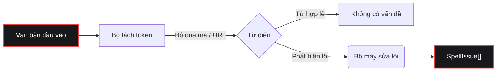

<div align="center">

[](https://www.gohit.xyz/package/fixnow)

<br>

<h1></h1>

<br>

<a href="https://www.npmjs.com/package/fixnow"></a>
<a href="https://www.npmjs.com/package/fixnow"></a>
<a href="https://github.com/bastndev/fixnow/blob/main/LICENSE"></a>
<a href="https://github.com/bastndev/fixnow/stargazers"></a>

<h1></h1>

<p >
  <a href="https://github.com/bastndev/fixnow/blob/main/public/docs/README_ES.md">Español 🇪🇸</a> |
  <a href="https://github.com/bastndev/fixnow/blob/main/public/docs/README_ZH.md">中文 🇨🇳</a> |
  <a href="https://github.com/bastndev/fixnow/blob/main/public/docs/README_DE.md">Deutsch 🇩🇪</a> |
  <a href="https://github.com/bastndev/fixnow/blob/main/public/docs/README_FR.md">Français 🇫🇷</a> |
  <a href="https://github.com/bastndev/fixnow/blob/main/public/docs/README_JA.md">日本語 🇯🇵</a> |
  <a href="https://github.com/bastndev/fixnow/blob/main/public/docs/README_KO.md">한국어 🇰🇷</a> |
  <a href="https://github.com/bastndev/fixnow/blob/main/public/docs/README_PT.md">Português 🇧🇷</a> |
  <a href="https://github.com/bastndev/fixnow/blob/main/public/docs/README_RU.md">Русский 🇷🇺</a> |
  <a href="https://github.com/bastndev/fixnow/blob/main/public/docs/README_VI.md">Tiếng Việt 🇻🇳</a> |
  <a href="https://github.com/bastndev/fixnow/blob/main/public/docs/README_HI.md">हिन्दी 🇮🇳</a> |
  <a href="https://github.com/bastndev/fixnow/blob/main/public/docs/README_AR.md">العربية 🇸🇦</a><span>...</span>
</p>

</div>

<br>

> Một trình kiểm tra lỗi chính tả đa ngôn ngữ nhỏ gọn với các đề xuất sửa lỗi. Từ điển đã được đóng gói sẵn, vì vậy chỉ cần `npm i fixnow` là bạn có mọi thứ — với **không phụ thuộc thời gian chạy**, hỗ trợ cả ESM và CommonJS.

## Tính năng

- 📦 **Không phụ thuộc** — Giữ cho `node_modules` của bạn gọn nhẹ và sạch sẽ.
- 🌍 **Từ điển tích hợp sẵn** — Bao gồm tiếng Ả Rập, Đức, Anh, Tây Ban Nha, Pháp, Bồ Đào Nha, Nga và Việt.
- ⚡ **Bản dựng nhẹ** — Chỉ nhập ngôn ngữ bạn cần (ví dụ `import { check } from "fixnow/vi"`) để tối ưu kích thước bundle.
- 🛡️ **Tách token thông minh** — Tự động bỏ qua các đoạn mã, URL, email và định danh để tránh báo lỗi sai.
- 🧩 **Đa năng** — Hoạt động mượt mà trong cả dự án ESM lẫn CommonJS.

## Kiến trúc



## Cài đặt

```bash
npm i fixnow
```

## Ngôn ngữ

| Mã   | Ngôn ngữ          | Giấy phép từ điển |
| ---- | ----------------- | ----------------- |
| `ar` | Tiếng Ả Rập       | LGPL-3.0          |
| `de` | Tiếng Đức         | LGPL-3.0          |
| `en` | Tiếng Anh         | MIT               |
| `es` | Tiếng Tây Ban Nha | LGPL-3.0          |
| `fr` | Tiếng Pháp        | MIT               |
| `pt` | Tiếng Bồ Đào Nha  | GPL-3.0-or-later  |
| `ru` | Tiếng Nga         | GPL-3.0-or-later  |
| `vi` | Tiếng Việt        | MIT               |

## Cách sử dụng

```ts
import { checkText, suggest, createChecker } from "fixnow";

// Tiếng Anh
const enIssues = await checkText("This sentance has a typo", {
  language: "en",
  suggestions: true,
});
// -> [{ offset: 5, length: 8, word: 'sentance', suggestions: [...] }]

// Tiếng Tây Ban Nha — bật khoan dung dấu nếu bạn không muốn "codigo" bị gắn cờ.
const esIssues = await checkText("Esto es un herror", {
  language: "es",
  suggestions: true,
  acceptAccentOmissions: true,
});
// -> [{ offset: 11, length: 6, word: 'herror', suggestions: [...] }]

// Đề xuất sửa lỗi một lần
await suggest("bonjoor", { language: "fr" }); // -> ['bonjour', ...]

// Một trình kiểm tra gắn với một ngôn ngữ
const de = createChecker("de");
await de.isCorrect("Haus"); // -> true
```

CommonJS cũng hoạt động:

```js
const { checkText } = require("fixnow");
```

### API

- `checkText(text, options)` → `Promise<SpellIssue[]>`
- `isCorrect(word, language, options?)` → `Promise<boolean>`
- `suggest(word, { language, max? })` → `Promise<string[]>`
- `createChecker(language)` → đã gắn `{ check, suggest, isCorrect, warmup }`
- `warmup(language?)` — tải trước từ điển (bỏ qua chi phí giải mã ở lần gọi đầu tiên)
- `tokenize(text, protectedSegments?)`, `DEFAULT_PROTECTED_PATTERN`
- `SUPPORTED_LANGUAGES`, `LANGUAGES`, `isSupportedLanguage`

**`CheckOptions`:** `language` (bắt buộc), `caseSensitive` (false), `acceptAccentOmissions`
(false; chỉ tiếng Tây Ban Nha), `suggestions`, `maxSuggestions` (5), `minWordLength` (3),
`ignoreWords`, `flagWords`, `isProtectedWord`, `protectedSegments`.

### Tách token

`checkText` bỏ qua mọi thứ nằm trong một "đoạn được bảo vệ" (đoạn mã, URL, email, đường dẫn, cờ CLI,
màu hex, TỪ VIẾT TẮT, tên tệp và định danh có dấu chấm). Ghi đè các mẫu bằng `protectedSegments`:

```ts
import { checkText, DEFAULT_PROTECTED_PATTERN } from "fixnow";

// Chỉ dùng mẫu của riêng bạn
await checkText(text, { language: "en", protectedSegments: /\{\{[^}]+\}\}/g });

// Kết hợp với mẫu mặc định
await checkText(text, {
  language: "en",
  protectedSegments: [DEFAULT_PROTECTED_PATTERN, /\{\{[^}]+\}\}/g],
});

// Tắt hoàn toàn việc bảo vệ
await checkText(text, { language: "en", protectedSegments: false });
```

Tùy chọn tương tự cũng có trong `tokenize(text, protectedSegments)`.

### Bản dựng nhẹ

Nếu bạn chỉ cần một ngôn ngữ, hãy nhập nó qua đường dẫn con của ngôn ngữ. Bộ đóng gói của bạn chỉ sao
chép từ điển bạn thực sự dùng:

```ts
import { check, suggest } from "fixnow/vi";

const issues = await check("Đây là môt văn bản", { suggestions: true });
await suggest("bonjoor", 3); // suggest đã gắn có dạng (word, max?)
```

Các điểm vào nhẹ (`fixnow/ar`, `fixnow/de`, `fixnow/en`, `fixnow/es`, `fixnow/fr`,
`fixnow/pt`, `fixnow/ru`, `fixnow/vi`) tái xuất một trình kiểm tra đã gắn sẵn với ngôn ngữ đó.

## Bundling

fixnow đọc các từ điển của nó từ đĩa khi chạy — chúng được phân phối dưới dạng tệp trong
`node_modules/fixnow/dictionaries/`, chứ không phải các byte nhúng trong JS. Vì vậy mọi bộ đóng gói phải
xem `fixnow` là **external**, để nó tải từ `node_modules` khi chạy. Điều này là bắt buộc với
**tiện ích mở rộng VS Code** và mọi **bundle CJS**: nhúng fixnow vào đầu ra CJS sẽ làm mất điểm neo
đường dẫn mà nó dùng để tìm các từ điển, và nó sẽ ném ra một lỗi rõ ràng "mark 'fixnow' as external"
thay vì phân giải chúng.

```js
// esbuild
await esbuild.build({
  entryPoints: ["src/extension.ts"],
  bundle: true,
  format: "cjs",
  platform: "node",
  external: ["fixnow"],
});
```

Tùy chọn tương ứng cho các bộ đóng gói khác:

- **Vite** — `build.rollupOptions.external: ['fixnow']`
- **Rollup** — `external: ['fixnow']`
- **webpack** — `externals: { fixnow: 'commonjs fixnow' }`

## Di chuyển từ 1.x

`2.0.0` dọn dẹp ba điểm gồ ghề từ bản trích xuất F1. Mỗi điểm là một thay đổi phá vỡ tương thích:

- **`language` giờ là bắt buộc.** Không còn ngôn ngữ mặc định nữa.
  ```ts
  // trước
  await checkText("hola"); // ngầm định tiếng Tây Ban Nha
  // sau
  await checkText("hola", { language: "es" });
  ```
- **`strict` được tách thành `caseSensitive` và `acceptAccentOmissions`.** Mặc định
  mới là nghiêm ngặt (tương đương `strict: true` cũ). Nếu bạn dựa vào `strict: false` để
  dung thứ việc thiếu dấu trong tiếng Tây Ban Nha, hãy bật rõ ràng:
  ```ts
  // trước
  await checkText("codigo", { language: "es" }); // được chấp nhận
  // sau
  await checkText("codigo", { language: "es", acceptAccentOmissions: true });
  ```
  Khóa cũ `strict` vẫn hoạt động trong 2.x với một `console.warn`; nó bị loại bỏ trong `3.0.0`.
- **Các điểm đánh dấu riêng của F1 đã bị loại khỏi bộ tách token mặc định.** `[Image #1]`, `[Skills #…]`,
  `/skills #N` và `/skill` không còn được tự động bỏ qua. Nếu bạn cần chúng, hãy truyền qua
  `protectedSegments`:
  ```ts
  const F1_MARKERS = /\[(?:Image|Code|Text) #\d+[^\]\n]*\]|\[Skills? #[^\]\n]+\]|\/skills #\d+|\/skill\b/g;
  await checkText(text, {
    language: "en",
    protectedSegments: [DEFAULT_PROTECTED_PATTERN, F1_MARKERS],
  });
  ```

## Giấy phép

[MIT](../../LICENSE)
