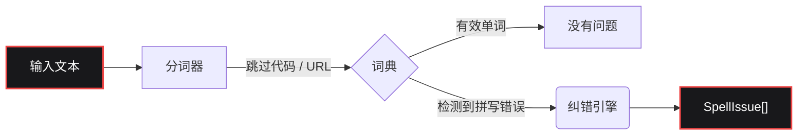

<div align="center">

[](https://www.gohit.xyz/package/fixnow)

<br>

<h1></h1>

<br>

<a href="https://www.npmjs.com/package/fixnow"></a>
<a href="https://www.npmjs.com/package/fixnow"></a>
<a href="https://github.com/bastndev/fixnow/blob/main/LICENSE"></a>
<a href="https://github.com/bastndev/fixnow/stargazers"></a>

<h1></h1>

<p >
  <a href="https://github.com/bastndev/fixnow/blob/main/public/docs/README_ES.md">Español 🇪🇸</a> |
  <a href="https://github.com/bastndev/fixnow/blob/main/public/docs/README_ZH.md">中文 🇨🇳</a> |
  <a href="https://github.com/bastndev/fixnow/blob/main/public/docs/README_DE.md">Deutsch 🇩🇪</a> |
  <a href="https://github.com/bastndev/fixnow/blob/main/public/docs/README_FR.md">Français 🇫🇷</a> |
  <a href="https://github.com/bastndev/fixnow/blob/main/public/docs/README_JA.md">日本語 🇯🇵</a> |
  <a href="https://github.com/bastndev/fixnow/blob/main/public/docs/README_KO.md">한국어 🇰🇷</a> |
  <a href="https://github.com/bastndev/fixnow/blob/main/public/docs/README_PT.md">Português 🇧🇷</a> |
  <a href="https://github.com/bastndev/fixnow/blob/main/public/docs/README_RU.md">Русский 🇷🇺</a> |
  <a href="https://github.com/bastndev/fixnow/blob/main/public/docs/README_VI.md">Tiếng Việt 🇻🇳</a> |
  <a href="https://github.com/bastndev/fixnow/blob/main/public/docs/README_HI.md">हिन्दी 🇮🇳</a> |
  <a href="https://github.com/bastndev/fixnow/blob/main/public/docs/README_AR.md">العربية 🇸🇦</a><span>...</span>
</p>

</div>

<br>

> 一个微型的多语言拼写检查器，支持纠错建议。词典已内置，只需 `npm i fixnow` 即可获得一切 —— **零运行时依赖**，同时支持 ESM 和 CommonJS。

## 功能特性

- 📦 **零依赖** —— 让你的 `node_modules` 保持干净轻量。
- 🌍 **内置词典** —— 包含阿拉伯语、德语、英语、西班牙语、法语、葡萄牙语、俄语和越南语。
- ⚡ **精简构建** —— 只导入你需要的语言（例如 `import { check } from "fixnow/zh"`）以优化打包体积。
- 🛡️ **智能分词** —— 自动忽略代码片段、URL、电子邮件和标识符，以防止误报。
- 🧩 **通用** —— 在 ESM 和 CommonJS 项目中都能无缝运行。

## 架构



## 安装

```bash
npm i fixnow
```

## 语言

| 代码 | 语言     | 词典许可证       |
| ---- | -------- | ---------------- |
| `ar` | 阿拉伯语 | LGPL-3.0         |
| `de` | 德语     | LGPL-3.0         |
| `en` | 英语     | MIT              |
| `es` | 西班牙语 | LGPL-3.0         |
| `fr` | 法语     | MIT              |
| `pt` | 葡萄牙语 | GPL-3.0-or-later |
| `ru` | 俄语     | GPL-3.0-or-later |
| `vi` | 越南语   | MIT              |

## 使用方法

```ts
import { checkText, suggest, createChecker } from "fixnow";

// 英语
const enIssues = await checkText("This sentance has a typo", {
  language: "en",
  suggestions: true,
});
// -> [{ offset: 5, length: 8, word: 'sentance', suggestions: [...] }]

// 西班牙语 —— 如果你不想让 "codigo" 被标记，可启用重音宽容模式。
const esIssues = await checkText("Esto es un herror", {
  language: "es",
  suggestions: true,
  acceptAccentOmissions: true,
});
// -> [{ offset: 11, length: 6, word: 'herror', suggestions: [...] }]

// 一次性纠错建议
await suggest("bonjoor", { language: "fr" }); // -> ['bonjour', ...]

// 绑定到特定语言的检查器
const de = createChecker("de");
await de.isCorrect("Haus"); // -> true
```

同样支持 CommonJS：

```js
const { checkText } = require("fixnow");
```

### API

- `checkText(text, options)` → `Promise<SpellIssue[]>`
- `isCorrect(word, language, options?)` → `Promise<boolean>`
- `suggest(word, { language, max? })` → `Promise<string[]>`
- `createChecker(language)` → 绑定的 `{ check, suggest, isCorrect, warmup }`
- `warmup(language?)` —— 预加载词典（跳过首次调用的解码开销）
- `tokenize(text, protectedSegments?)`、`DEFAULT_PROTECTED_PATTERN`
- `SUPPORTED_LANGUAGES`、`LANGUAGES`、`isSupportedLanguage`

**`CheckOptions`：** `language`（必填）、`caseSensitive`（false）、`acceptAccentOmissions`
（false；仅西班牙语）、`suggestions`、`maxSuggestions`（5）、`minWordLength`（3）、
`ignoreWords`、`flagWords`、`isProtectedWord`、`protectedSegments`。

### 分词

`checkText` 会跳过任何位于“受保护片段”中的内容（代码片段、URL、电子邮件、路径、CLI 标志、十六进制颜色、
首字母缩写、文件名和带点的标识符）。可用 `protectedSegments` 覆盖这些模式：

```ts
import { checkText, DEFAULT_PROTECTED_PATTERN } from "fixnow";

// 仅使用你自己的模式
await checkText(text, { language: "en", protectedSegments: /\{\{[^}]+\}\}/g });

// 与默认模式组合
await checkText(text, {
  language: "en",
  protectedSegments: [DEFAULT_PROTECTED_PATTERN, /\{\{[^}]+\}\}/g],
});

// 完全禁用保护
await checkText(text, { language: "en", protectedSegments: false });
```

同样的选项也在 `tokenize(text, protectedSegments)` 中暴露。

### 精简构建

如果你只需要一种语言，可通过该语言的子路径导入。你的打包工具只会复制你实际使用的词典：

```ts
import { check, suggest } from "fixnow/zh";

const issues = await check("Esto es un herror", { suggestions: true });
await suggest("bonjoor", 3); // 绑定的 suggest 形式为 (word, max?)
```

精简入口（`fixnow/ar`、`fixnow/de`、`fixnow/en`、`fixnow/es`、`fixnow/fr`、
`fixnow/pt`、`fixnow/ru`、`fixnow/vi`）会重新导出一个已绑定到该语言的检查器。

## 打包（Bundling）

fixnow 在运行时从磁盘读取其词典 —— 它们以文件形式随包发布在
`node_modules/fixnow/dictionaries/`，而不是内联到 JS 中的字节。因此任何打包工具都必须将
`fixnow` 视为**外部依赖（external）**，让它在运行时从 `node_modules` 加载。这对于
**VS Code 扩展**和任何 **CJS 包**都是必需的：将 fixnow 内联到 CJS 输出中会移除它用于定位词典的
路径锚点，它会抛出一个明确的 "mark 'fixnow' as external" 错误，而不是解析它们。

```js
// esbuild
await esbuild.build({
  entryPoints: ["src/extension.ts"],
  bundle: true,
  format: "cjs",
  platform: "node",
  external: ["fixnow"],
});
```

其他打包工具的对应选项：

- **Vite** —— `build.rollupOptions.external: ['fixnow']`
- **Rollup** —— `external: ['fixnow']`
- **webpack** —— `externals: { fixnow: 'commonjs fixnow' }`

## 从 1.x 迁移

`2.0.0` 清理了从 F1 抽离版本中的三处粗糙之处。每一处都是破坏性变更：

- **`language` 现在是必填项。** 不再有默认语言。
  ```ts
  // 之前
  await checkText("hola"); // 隐式西班牙语
  // 之后
  await checkText("hola", { language: "es" });
  ```
- **`strict` 拆分为 `caseSensitive` 和 `acceptAccentOmissions`。** 新的
  默认值为严格（即旧的 `strict: true`）。如果你曾依赖 `strict: false` 来
  容忍西班牙语的重音省略，请显式启用：
  ```ts
  // 之前
  await checkText("codigo", { language: "es" }); // 被接受
  // 之后
  await checkText("codigo", { language: "es", acceptAccentOmissions: true });
  ```
  旧的 `strict` 键在 2.x 中仍可用，但会发出 `console.warn`；它将在 `3.0.0` 中移除。
- **F1 专用标记已从默认分词器中移除。** `[Image #1]`、`[Skills #…]`、
  `/skills #N` 和 `/skill` 不再自动跳过。如果你需要它们，请通过
  `protectedSegments` 传入：
  ```ts
  const F1_MARKERS = /\[(?:Image|Code|Text) #\d+[^\]\n]*\]|\[Skills? #[^\]\n]+\]|\/skills #\d+|\/skill\b/g;
  await checkText(text, {
    language: "en",
    protectedSegments: [DEFAULT_PROTECTED_PATTERN, F1_MARKERS],
  });
  ```

## 许可证

[MIT](../../LICENSE)
